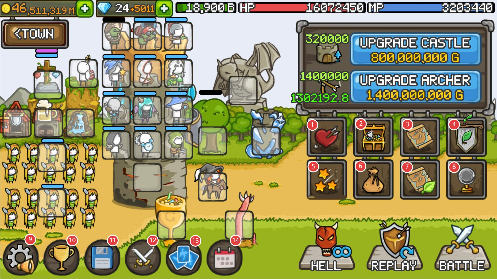
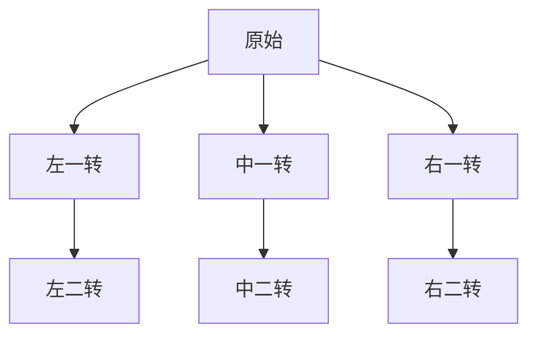
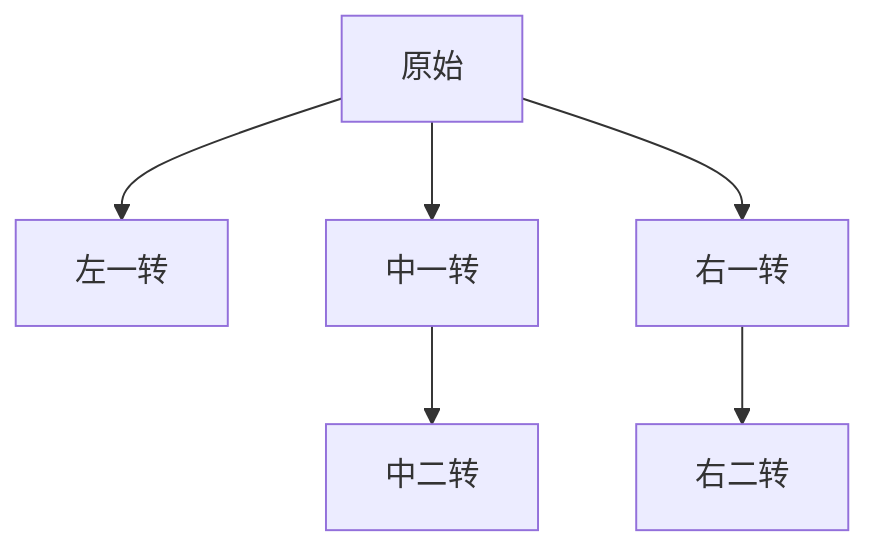
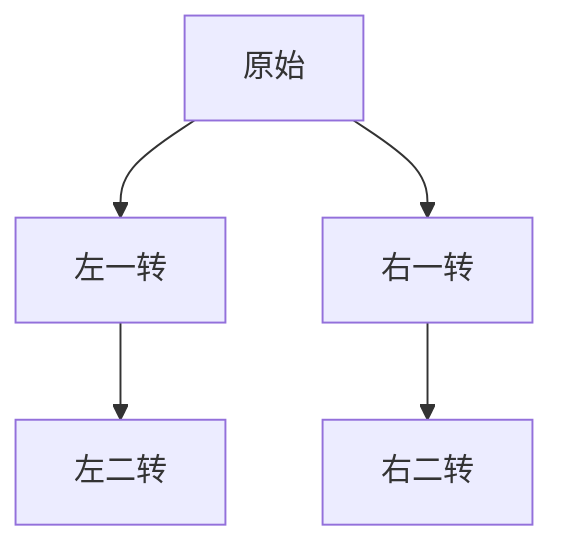

# 入门

成长城堡是一款放置游戏，目前已知其支持韩语、英语和日语，虽然没有中文，但游戏内的单词词汇量少、容易理解，因此上手快。

接下来将是游戏的介绍。

# 界面介绍

1. **天赋**：随等级提升可以逐步获得天赋点，用于提升属性。在图片上面、血条左边的绿色条，就是经验条，每提升一级可获得一个天赋点，每个天赋点最高等级为 20 级。
2. **宝物**：通过金币、钻石购买，部分宝物需要攻破特殊殖民地才能获得。不同宝物能带来不同效果。
3. **殖民地**：攻破不同殖民地可获得不同效果，包括定时提供金币、给城弓提供 buff、后院增加兽人矿工。通常这里是金币的重要来源之一。
4. **公会**：公会中有其他成员，有公会频道聊天，能提供一系列增益，并且公会进入公会榜前百可以获得奖励。这个是玩家发展的重要部分。
5. **技能树**：消耗技能点获取属性。技能点通过达成目标总波数，或英雄、领军、部分城内塔和门前塔的等级达到**一万级**后，可获得一个技能点。
6. **背包**：存放道具、装备、符文等物品的地方。
7. **赛季殖民地**：每两个赛季 (十天) 更新一次的殖民地，固定现实的 10 分钟获得一次金币。
8. **宝珠**：提供大量增益，需要单位等级达到**一万级**后才能购买和装备。可装备对象为英雄、领军、城弓 (需要点技能点)、门前塔 (需要点技能点)。
9. **设置**
10. **排行榜**

> \[!TIP] 提示
> 排行榜右上角可以修改自己的游戏 ID。

11. **存档、读档**：用于保存、读取存档。

> \[!CAUTION] 重要提示
> 一定要记得多存档！存档丢失、存档回溯可能会严重影响游戏进度，包括丢失波数、**丢失装备**、**丢失道具**等不可逆情况。

12. **战斗记录**：记录战斗中的各单位伤害量与收入，最多可查看最近十波的数据。
13. **阵容**：最多可保存 5 个阵容栏，强烈建议给不同用处的阵容各配置一个阵容栏，如**推波阵**、**殖民地阵**、**无尽阵**、**刷物阵**等。
14. **签到**：每天可获得奖励，每六天为一个签到周期。签到更新时间为北京时间晚上 11 点。(因为这是韩国游戏，对应到 UTC+9 就正好是凌晨 12 点)

# 英雄介绍

## Archer - 黄毛

| 转职   | 转职特性                            | 技能                                                                                                                                                                       |
| ------ | ----------------------------------- | -------------------------------------------------------------------------------------------------------------------------------------------------------------------------- |
| 原始   | -                                   | **Strafe - 一技能**：伤害倍率 300%；攻速 + 100%；持续时间 5 秒 **Boss Hunter - 二技能**：对 BOSS 伤害 +100%                                                            |
| 左一转 | **基础攻速 + 50%**                  | **Strafe - 一技能**：伤害倍率 300%；攻速 + 100%；持续时间 5 秒 **Boss Hunter - 二技能**：对 BOSS 伤害 +100%                                                            |
| 中一转 | 一技能持续时间 + 2 秒               | **Strafe - 一技能**：伤害倍率 300%；攻速 + 100%；持续时间 7 秒 **Boss Hunter - 二技能**：对 BOSS 伤害 +100%                                                            |
| 右一转 | 一技能持续时间 + 2 秒 转为电系  | **Strafe - 一技能**：伤害倍率 300%；攻速 + 100%；持续时间 7 秒 **Boss Hunter - 二技能**：对 BOSS 伤害 +100%                                                            |
| 左二转 | 获得新技能                          | **Strafe - 一技能**：伤害倍率 300%；攻速 + 100%；持续时间 5 秒 **Boss Hunter - 二技能**：对 BOSS 伤害 +100% **Archer Trio - 三技能**：场上其他弓系角色 + 200% 攻速 |
| 中二转 | 获得新技能                          | **Strafe - 一技能**：伤害倍率 300%；攻速 + 100%；持续时间 7 秒 **Boss Hunter - 二技能**：对 BOSS 伤害 +100% **Archer Trio - 三技能**：场上其他弓系角色 + 150% 攻速 |
| 右二转 | **基础攻击力 + 20%** 获得新技能 | **Strafe - 一技能**：伤害倍率 300%；攻速 + 100%；持续时间 7 秒 **Boss Hunter - 二技能**：对 BOSS 伤害 +100% **Archer Trio - 三技能**：场上其他弓系角色 + 200% 攻速 |

## Hunter - 绿叶

| 转职   | 转职特性                                       | 技能                                                                                                                                                                                                     |
| ------ | ---------------------------------------------- | -------------------------------------------------------------------------------------------------------------------------------------------------------------------------------------------------------- |
| 原始   | -                                              | **Haste - 一技能**：城弓攻速 + 200%；持续时间 5 秒                                                                                                                                                       |
| 左一转 | **一技能持续时间 + 1.5 秒** **获得新技能** | **Haste - 一技能**：城弓攻速 + 200%；持续时间 6.5 秒 **Blessing of Haste - 二技能**：释放一技能额外给城弓 + 120% 攻击；持续时间 6 秒                                                                 |
| 中一转 | 修改一技能 获得新技能 转为电系         | **Lightning Arrow - 一技能**：伤害倍率 110%；持续时间 10 秒；命中敌人时对附近的另一名敌人造成伤害 **Multiple Shot - 二技能**：射击 + 3 箭                                                            |
| 右一转 | 修改一技能 获得新技能                      | **Ballista Sentry - 一技能**：地上创建三个弩箭：伤害倍率 200%；持续时间 10 秒 **Multiple Shot - 二技能**：射击 + 3 箭                                                                                |
| 左二转 | 获得新技能                                     | **Haste - 一技能**：城弓攻速 + 200%；持续时间 5 秒 **Blessing of Haste - 二技能**：释放一技能额外给城弓 + 120% 攻击；持续时间 6 秒 **Archer Trio - 三技能**：场上其他弓系角色 + 150% 攻速        |
| 中二转 | 获得新技能                                     | **Lightning Arrow - 一技能**：伤害倍率 110%；持续时间 10 秒；命中敌人时对附近的另一名敌人造成伤害 **Multiple Shot - 二技能**：射击 + 3 箭 **Archer Trio - 三技能**：场上其他弓系角色 + 150% 攻速 |
| 右二转 | 获得新技能                                     | **Ballista Sentry - 一技能**：地上创建三个弩箭；伤害倍率 200%；持续时间 10 秒 **Multiple Shot - 二技能**：射击 + 3 箭 **Archer Trio - 三技能**：场上其他弓系角色 + 150% 攻速                     |

## ELF - 黑毛

| 转职   | 转职特性       | 技能                                                                                                                                                                                         |
| ------ | -------------- | -------------------------------------------------------------------------------------------------------------------------------------------------------------------------------------------- |
| 原始   | -              | **MP Steal - 一技能**：造成伤害时恢复蓝量，恢复量为伤害量的 2%                                                                                                                               |
| 左一转 | **修改一技能** | **HP Steal - 一技能**：造成伤害时恢复生命，恢复量为伤害量的 6%                                                                                                                               |
| 中一转 | 获得新技能     | **HP Steal - 一技能**：造成伤害时恢复生命，恢复量为伤害量的 3% **MP Steal - 二技能**：造成伤害时恢复蓝量，恢复量为伤害量的 2%                                                            |
| 右一转 | 强化一技能     | **MP Steal - 一技能**：造成伤害时恢复蓝量，恢复量为伤害量的 5%                                                                                                                               |
| 左二转 | 获得新技能     | **HP Steal - 一技能**：造成伤害时恢复生命，恢复量为伤害量的 6% **Archer Trio - 二技能**：场上其他弓系角色 + 150% 攻速                                                                    |
| 中二转 | 获得新技能     | **HP Steal - 一技能**：造成伤害时恢复生命，恢复量为伤害量的 3% **MP Steal - 二技能**：造成伤害时恢复蓝量，恢复量为伤害量的 2% **Archer Trio - 三技能**：场上其他弓系角色 + 150% 攻速 |
| 右二转 | 获得新技能     | **MP Steal - 一技能**：造成伤害时恢复蓝量，恢复量为伤害量的 5% **Archer Trio - 二技能**：场上其他弓系角色 + 150% 攻速                                                                    |

## Dark Skeleton - 骨弓

| 转职   | 转职特性                       | 技能                                                                                                                                                                          |
| ------ | ------------------------------ | ----------------------------------------------------------------------------------------------------------------------------------------------------------------------------- |
| 原始   | -                              | **Pointer Bone - 一技能**：城弓暴击率 + 20%；持续时间 5 秒                                                                                                                    |
| 左一转 | 获得新技能                     | **Pointer Bone - 一技能**：城弓暴击率 + 20%；持续时间 5 秒 **Hungry Soul - 二技能**：蓝量低于 10% 时，城弓伤害 + 10%                                                      |
| 中一转 | 获得新技能                     | **Pointer Bone - 一技能**：城弓暴击率 + 20%；持续时间 5 秒 **Full on Soul - 二技能**：蓝量高于 90% 时，城弓伤害 + 10%                                                     |
| 右一转 | 修改一技能 基础攻速 + 200% | **Strange Strafe - 一技能**：当[黄毛 (Archer)](#archer---黄毛)不在场时，模仿黄毛的一技能：伤害倍率 300%；攻速 + 100%；持续时间 5 秒                                           |
| 中二转 | 强化一技能                     | **Pointer Bone - 一技能**：城弓暴击率 + 20%；城弓暴击伤害 + 100%；持续时间 5 秒 **Full on Soul - 二技能**：蓝量高于 90% 时，城弓伤害 + 10%                                |
| 右二转 | 获得新技能                     | **Strange Strafe - 一技能**：当黄毛 (Archer) 不在场时，模仿黄毛的一技能：伤害倍率 300%；攻速 + 100%；持续时间 5 秒 **Archer Trio - 二技能**：场上其他弓系角色 + 150% 攻速 |

## Ice Mage - 冰法

| 转职   | 转职特性                        | 技能                                                                                                                                                                                                 |
| ------ | ------------------------------- | ---------------------------------------------------------------------------------------------------------------------------------------------------------------------------------------------------- |
| 原始   | -                               | **Frozen - 一技能**：范围冰冻敌人：伤害倍率 50%；持续时间 6 秒                                                                                                                                       |
| 左一转 | 基础攻击力 + 50% 获得新技能 | **Frozen - 一技能**：范围冰冻敌人：伤害倍率 50%；持续时间 6 秒 **Ice Blast - 二技能**：增加爆炸范围；冰冻命中敌人：持续时间 5 秒                                                                 |
| 右一转 | 增加一技能冰冻范围              | **Frozen Field - 一技能**：范围冰冻敌人：伤害倍率 50%；持续时间 5 秒                                                                                                                                 |
| 左二转 | 获得新技能                      | **Frozen - 一技能**：范围冰冻敌人：伤害倍率 50%；持续时间 6 秒 **Ice Blast - 二技能**：增加爆炸范围；冰冻命中敌人：持续时间 5 秒 **Elemental Fusion - 三技能**：场上其他法系角色 + 125% 伤害 |
| 右二转 | 获得新技能                      | **Frozen Field - 一技能**：范围冰冻敌人：伤害倍率 50%；持续时间 5 秒 **Elemental Fusion - 二技能**：场上其他法系角色 + 125% 伤害                                                                 |

