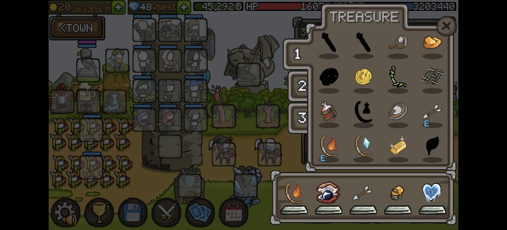
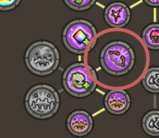
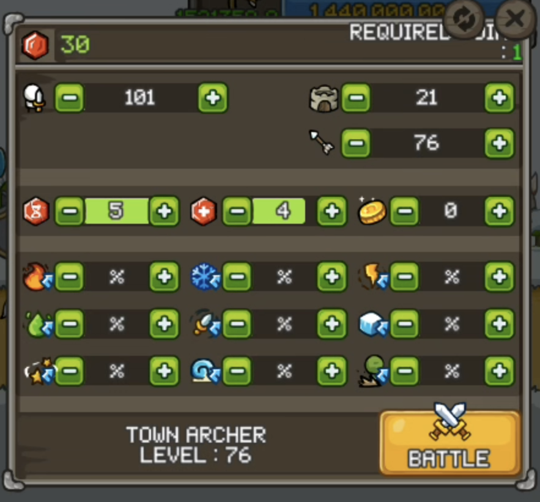

# 阵容构建与装备要求

> [!IMPORTANT] 重要提示
> 除了重要控制角色与低 CD 要求角色，如小炮、投矛和小飞机，以及白袍、黑袍、绿叶和骨弓，其他角色尽可能地多凑金 C。

## 宙斯
   
右转职，飞行目标。装备词条携带**攻速**和**击晕**，宝珠携带**电攻速宝珠**。

## 小飞机

火转职，自动索敌。装备词条携带**至少 3 条击晕**和**减速**，也可以携带**加一召**。

> [!TIP] 建议
> 如果装备够好，可以转为**冰转职**，装备携带**4 条击晕**和**双加一召**。

## 刺客

左转职，飞行索敌。装备词条携带**红白**和**攻速**，符文必须有**加一刀**。

> [!TIP] 建议
> 装备词条也可以选择**纯攻速**，宝珠携带**电攻速宝珠**或**攻速宝珠**。

## 小炮

左转职，距离最近索敌。装备词条携带**至少 3 条击晕**和**减速**。

> [!NOTE] 提示
> **3 晕 + 1 减速**  比  **4 晕**  词条更好。

## 石头人

中转职，距离最近索敌。装备词条携带**攻速** / **控制类词条**和**加一召**，宝珠携带**攻速宝珠**。

> [!NOTE] 提示
> 石头人召唤的元素石像类型与所站层数有关，站在第二层召唤冰石像。

石头人需要站在第二层，召唤冰石像。如果携带攻速词条，面板中的 **ATTACKS PER SECOND** 比城弓的值更高，则可以携带攻速词条，否则携带控制类词条即可。

> [!TIP] 建议
> 如果石头人面板上的 **ATTACKS PER SECOND** 值比城弓的值高，则可以在技能树中点出如下技能点，将石头人的攻击速度应用到城弓上。
> 

## 冰法

左转职，飞行索敌。装备词条携带**攻速**和**红 C**。

## 弓巫&法巫

双毒转职 或 一毒一冰转职，最近距离索敌。装备词条携带**击退**、**击晕**，可额外携带**加一召**，毒转职可携带**减速**。

## 投矛

物转职（一转），飞行索敌 或 最近距离索敌。装备词条携带**击晕**和**减速**，宝珠携带**物理宝珠**。

## 火领&冰领

最进距离索敌。装备词条携带**控制类词条**即可。

## 绿叶&黑袍&骨弓

正常转职（应该没人会往其他方向转吧？），最近距离索敌。装备词条携带**红白**，此外最好再带**控制类词条**。

## 城弓

方案 1：飞行索敌。多携带**火伤、伤害**词条，宝珠携带**危机宝珠**，符文为**火伤符文**或**攻速符文**。

方案 2：自动索敌。携带 **1 暴率 + 3 暴伤** 词条，若有更好的装备，可携带 **1 暴率 + 4 暴伤 + 1 火伤** 词条，或可更换一条**飞行伤害**词条，宝珠携带**攻速宝珠**或**火暴伤宝珠**。

---

# 技能树

根据技能点数，选择技能树的点法，优先点出以下技能点。如果点数不够就从内圈走；如果点数够，走外圈亦可。

由于该流派为火弓流派，英雄角色的输出占比极低，因此技能树内圈负收益可忽略不计，并且技能树起点没有要求。

> [!TIP] 提示
> 1. 技能树上的属性伤害降低效果对城弓不生效。
> 2. 建议从火系技能树开始点起。因为另一个主流高分无尽流派为火系混弓，之后转阵也更方便。

## 全系

- **六系大剑**

## 电系

- **电系加攻速**
- **宙斯攻击方式变更**
- **刺客 +1 刀和 debuff 额外生效一次**
- **飞行增伤**
- **眩晕增伤**

## 召唤系

- **投矛穿透**
- **召唤物死亡重生**
- **石头人召唤元素石技能额外生效一次**
- 召唤物吸血（可选）
- 召唤物增加火抗性（可选）

## 毒系

- **中毒减防**
- 中毒效果时间延长（可选）

## 冰系

- **冰系减速**
- **冰法冰冻控制时间增加**
- **减速增伤**
- **冰冻增伤**
- 冰领技能概率冰冻（可选）

## 物理系

- **物系加攻速**
- **城弓、绿叶 Haste 技能持续时间 +1 秒**
- 所有单位加防御（可选）

## 火系

- **火系加攻速**

## 外圈

- **城弓可携带宝珠**
- **城弓可携带 A、S 级装备（根据实际情况选择）**
- 门前塔可携带宝珠（可选）
- 弓箭系英雄增加攻速效果可应用于自身（可选）
- 领军增加防御（可选）

---

# 局内加点

> [!NOTE] 说明
> 1. 如果阵容内没有宙斯，英雄加点到 51 级即可。
> 2. 如果自己足够自信能打到高分，可以把第二栏点到 5 / 5。

图中的加点用于危机宝珠的城弓，进入无尽模式后，将剩下的 30 个点全部加到城堡上，以触发危机宝珠的效果。

在局内，英雄等级不需要提升；城堡等级根据局内情况灵活升级，通常也不用升级。

先将城弓等级升到 1000 级，后面再接着把**火抗性**、**眩晕抗性**和**冰冻抗性**逐渐点满；**减速抗性**需要点最低 40 点；**击退抗性**需要点最低 30 点。

后续再继续升级城弓，有没点满的抗性点数可以继续点满，或者根据局内情况灵活调整。

---

# 局内操作

无尽模式的出怪模式是一波一波的，怪物的属性会随着总伤害（分数）的增加而增加。

通常来说，地面只需要冰法和小炮交替控制即可，**但要尽量避免控制重叠！**

最难处理的是空军，需要控制好空军的数量，尽量让城弓保持在对空的输出状态。每出一大波空军，就需要同时使用绿叶、黑袍、骨弓和刺客来一波清掉空军。在前中期，如果小飞机还能稳定控制空军，可以尝试把怪堆起来，等出到下一波空军时再一起清掉。

等到一波技能释放完，立刻白袍减 CD，这样可以几乎立即刷新好一波技能，为下一波清空军做好准备。

城弓自身的技能通常是用来衔接两波空军之间的空档期，或者在技能 CD 期间使用。

简而言之，四个英雄技能用来清大波空军，城弓自身技能用来续接强化状态以及兜底。

下方的道具的使用顺序通常为：**沙漏 -> 雷电 -> 大剑**

这个顺序能用来将分数最大化。

雕像的技能通常不需要留到后面，其释放时机和沙漏与雷电差不多，留到后面使用的效果也不好。

---

# 结语

无尽需要的是更多的练习，熟悉自己的阵容，熟悉出怪的规律，有丰富的临场反应能力，善用冰法、小炮、升级页面和返回页面给自己思考的时间，才能在无尽模式中获得更高的分数。

不过，无尽最考验的还是自身装备的练度。如果想要打出高分，好装备是必不可少的。

记住，**不要贪分，不要贪分，不要贪分**！贪分导致暴毙的情况比比皆是，道具该用就用，不要留着贪那一点点分数，尤其是能打高分的时候贪分导致暴毙，是很让人难受的事。如果你不清楚，亲身经历一次就知道了！

祝大家在无尽模式中都能打出自己满意的分数！