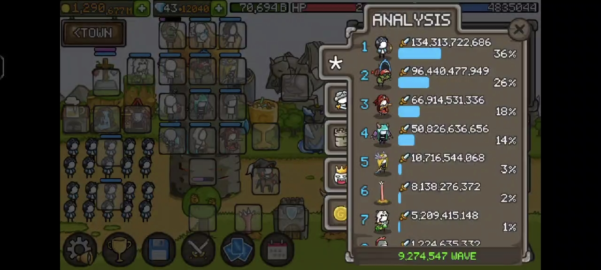
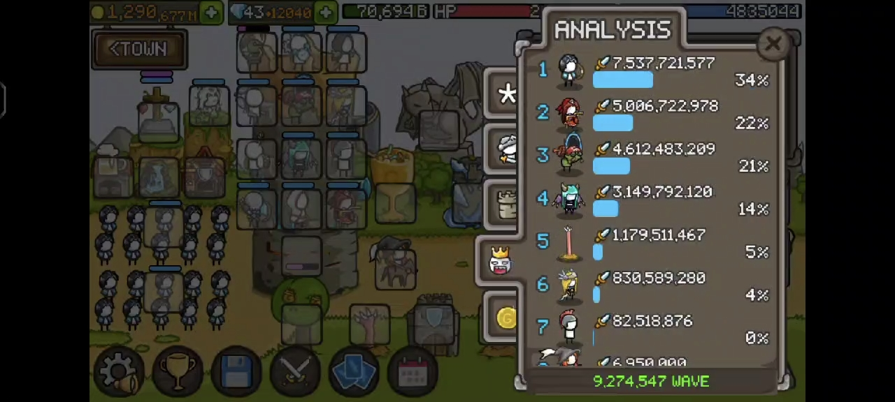
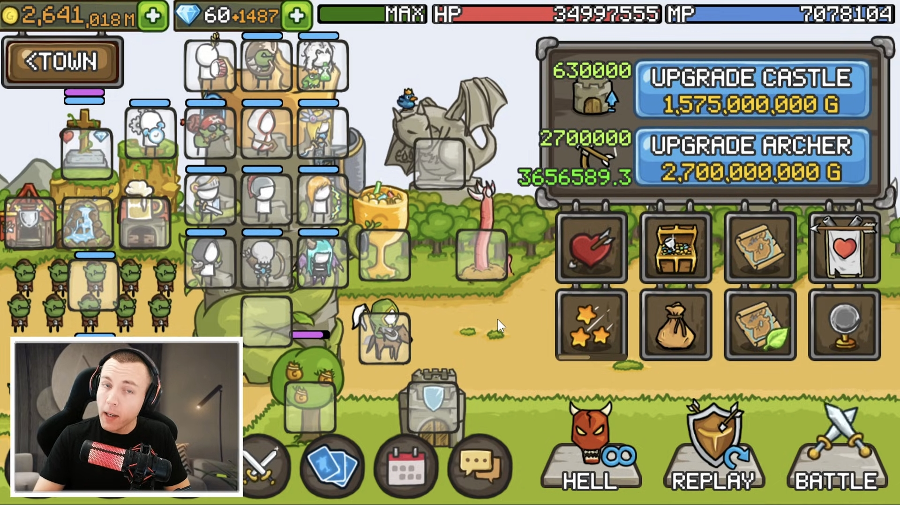
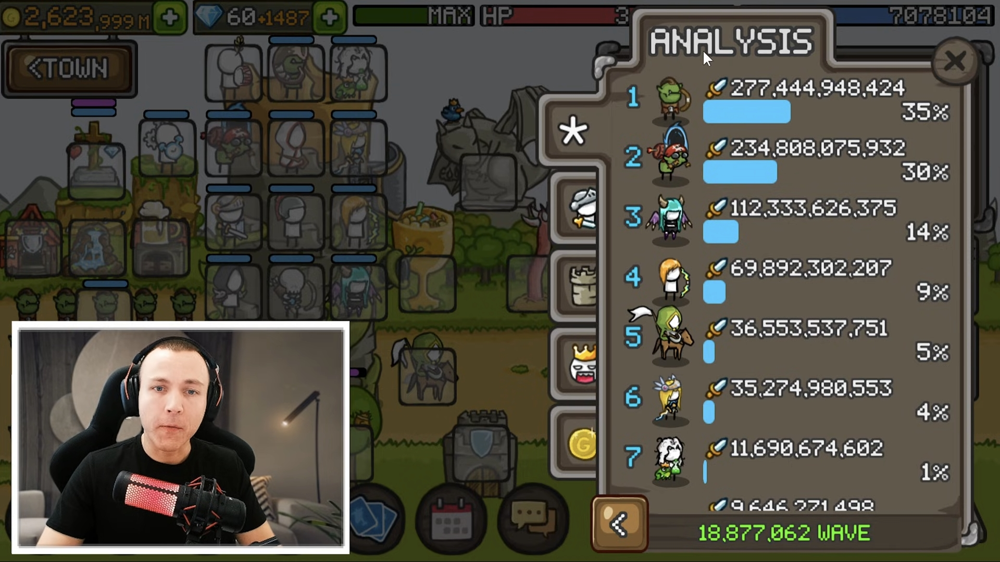
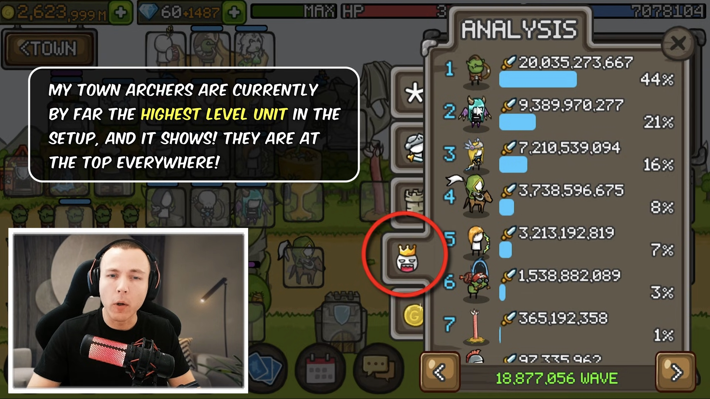
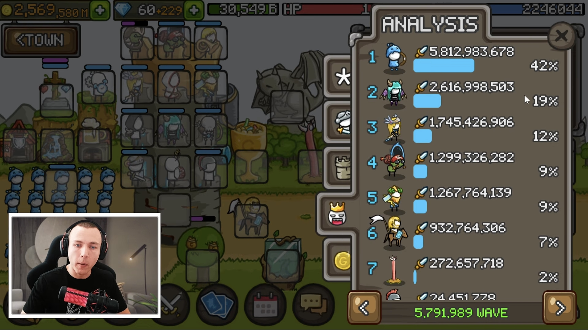
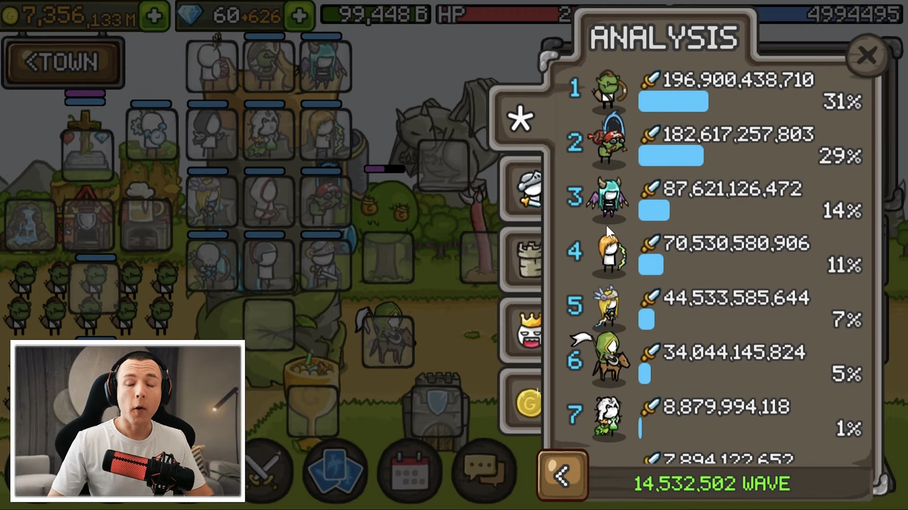
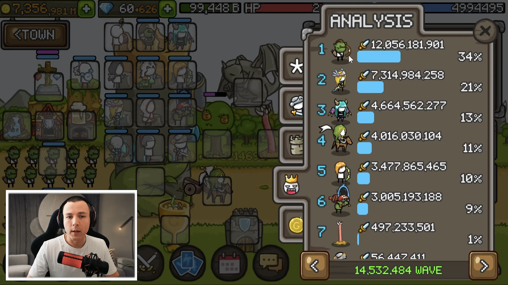
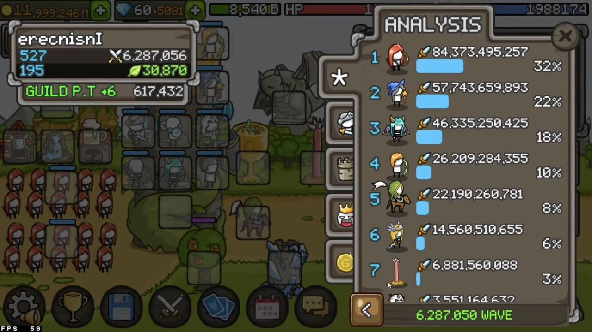
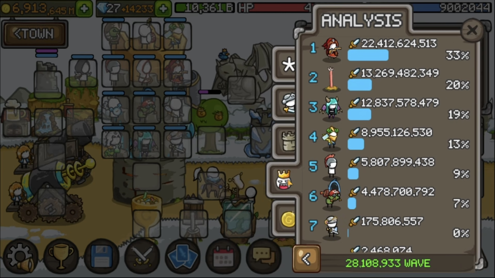

import EquipDisplay from "./EquipDisplay.astro";

export const ratio = (totalWaves, level) =>
  (totalWaves / level).toFixed(2);

export const castleGold = (level) => 
  level * level * 1250;

export const taGold = (level) =>
  level * level * 500;

export const heroGold = (level) => {
  if (level <= 0) return 0;

  const thresholds = [
    10000, 5000, 200, 180, 160, 140, 120, 100, 80, 60, 40, 20, 1,
  ];
  const baseGold = [
    187458432500, 37468432500, 35632500, 26157500, 18530000, 12530000,
    7997500, 4712500, 2475000, 1085000, 342500, 47500, 0,
  ];
  const baseMultiplier = [
    50000000, 20000000, 600000, 450000, 360000, 280000, 210000, 150000,
    100000, 60000, 30000, 10000, 250,
  ];
  const increment = [
    5000, 4000, 3000, 2500, 2250, 2000, 1750, 1500, 1250, 1000, 750, 500, 250,
  ];

  for (let i = 0; i < thresholds.length; i++) {
    if (level > thresholds[i]) {
      const diff = level - thresholds[i];
      return ((baseMultiplier[i] * 2 + increment[i] * (diff - 1)) / 2 * diff) +
        baseGold[i];
    }
  }

  return 0;
};

export const buildRatio = (totalWaves, totalGold) =>
  (totalGold / (totalWaves ** 2)).toFixed(2);

export const teacher_coke = {
  totalWaves: 9274547,
  castle: 435000,
  ta: 1486000,
  goblin: 470500,
  angel: 100000,
  succubus: 360010,
  slingers: 60000,
  elizabeth: 410000,
  worm: 215000,
}

export const lakujk = {
  totalWaves: 18900000,
  castle: 630000,
  ta: 2700000,
  sara: 575000,
  goblin: 720000,
  succubus: 865000,
  slingers: 110000,
  angel: 150000,
  archer: 567000,
  worm: 305000,
  paladins: 150000,
}

export const nl_nemes1s = {
  totalWaves: 5792957,
  castle: 200000,
  ta: 850000,
  goblin: 240000,
  succubus: 250000,
  zeus: 180000,
  thor: 162000,
  worm: 90000,
  paladins: 61000,
  angel: 50000,
  slingers: 40000,
}

export const queencalypso = {
  totalWaves: 14550000,
  castle: 445000,
  ta: 1760000,
  sara: 510000,
  succubus: 550000,
  goblin: 515000,
  archer: 500000,
  worm: 210000,
  paladins: 120000,
  slingers: 120000,
  angel: 120000,
}

export const erecnisnI = {
  totalWaves: 6280000,
  castle: 180050,
  ta: 777778,
  archer: 220000,
  angel: 90023,
  iceSorceress: 223000,
  paladins: 90020,
  succubus: 240000,
  slingers: 68010,
  sara: 235020,
  worm: 132233,
}

export const ad_dizzydreamz = {
  totalWaves: 3112567,
  castle: 222225,
  ta: 600000,
  goblin: 135000,
  windy: 150000,
  zeus: 135000,
  succubus: 180000,
  paladins: 44444,
  slingers: 44444,
  worm: 111111,
}

export const rb_mana = {
  totalWaves: 28109000,
  castle: 810000,
  elizabeth: 1200000,
  goblin: 1237000,
  zeus: 1100000,
  succubus: 1100000,
  worm: 1170000,
  paladins: 200000,
  slingers: 100000,
};

# Teacher coke

**城弓 | 伊丽莎白 | 炸弹人 | 魅魔**

***白袍 CD 最高的山之一。***

- 发布日期：2026-07-14

- 收录日期：2026-07-14

- 更新日期：2026-07-17

## 阵容图

## 角色装备与属性

> [!WARNING] 警告
> 该阵容中的金 C 数量为 23 + 1，且部分单位并未使用最优装备，请知悉。

|单位|面板|武器|饰品|
|:----:|:----:|:----:|:----:|
|白袍|CD: 5.36|<EquipDisplay w={['COOLDOWN -9.2% -> 11.3%', 'FIRE DAMAGE +24.6% -> 30.1%']} r={['COOLDOWN -1.9 -> 2.3 SECONDS']} y={['ITEM QUALITY +22.6%']} />|<EquipDisplay w={['COOLDOWN -9.7% -> 12.1%', 'LIGHTNING DAMAGE +22.8% -> 28.5%']} r={['COOLDOWN -2.0 -> 2.5 SECONDS']} y={['ITEM QUALITY +24.9%']} b={['COOLDOWN SKILL LV +1', 'CRITICAL CHANCE SKILL LV +1']} />|
|城弓|CD: 8.81|<EquipDisplay w={['DAMAGE +19.9%', 'DAMAGE +18.9%']} b={['OWN BONUS GOLD +3.3%', 'OWN BONUS GOLD +3.2%']} />|<EquipDisplay w={['CRITICAL DAMAGE +48.4%', 'DAMAGE +18.6%', 'CRITICAL DAMAGE +46.9%']} y={['DAMAGE SKILL LV +1']} b={['CAN BE EQUIPPED TO TOWN ARCHERS', 'ATTACK SPEED +9.8%']} />|
|伊丽莎白|CD: 5.27 蓝耗: 0|<EquipDisplay w={['CRITICAL CHANCE +9.8%', 'COOLDOWN -9.7%']} r={['COOLDOWN -2.0 SECONDS']} y={['POISON MASTERY SKILL LV +1']} b={['KRAKEN +2', '9.9% CHANCE TO SUMMON A KRAKEN', 'ON ATTACK.']} />|<EquipDisplay w={['COOLDOWN -9.3% -> 11.4%', 'DAMAGE +18.2% -> 22.3%']} r={['COOLDOWN -1.9 -> 2.4 SECONDS']} y={['ITEM QUALITY +22.5%']} b={['OWN BONUS GOLD +4.0%']} />|
|炸弹人|CD: 10.04|<EquipDisplay w={['CRITICAL DAMAGE +47.0%', 'CRITICAL CHANCE +9.6%']} r={['COOLDOWN -1.9 SECONDS']} y={['COOLDOWN SKILL LV +1']} b={['TNT DAMAGE +48%', 'ATTACK SPEED +9.9%']} />|<EquipDisplay w={['CRITICAL DAMAGE +46.8%', 'CRITICAL CHANCE +9.3%', 'COOLDOWN -9.4%']} y={['COOLDOWN SKILL LV +1']} b={['OWN BONUS GOLD +3.9%', 'OWN BONUS GOLD +4.0%']} />|
|魅魔|CD: 11.01|<EquipDisplay w={['ATTACK SPEED +18.5%', 'CRITICAL CHANCE +10.0%', 'CRITICAL CHANCE +10.0%']} b={['ATTACK SPEED +9.6%', 'ATTACK SPEED +9.9%']} />|<EquipDisplay w={['ATTACK SPEED +18.0%', 'ATTACK SPEED +18.2%', 'CRITICAL CHANCE +9.0%']} y={['BONUS SKILL LV +1']} b={['ATTACK SPEED +9.6%', 'ATTACK SPEED +9.8%']} />|
|天使|CD: 10.74|<EquipDisplay w={['STUN CHANCE +19.0%', 'COOLDOWN -9.2%']} r={['DAMAGE REDUCED BY +23%', '(LEADER, SUMMONER ONLY)']} y={['COOLDOWN SKILL LV +1']} b={['SUMMONED HP +9.8%']} />|<EquipDisplay w={['FIRE DAMAGE +23.5%', 'COOLDOWN -9.5%']} r={['DAMAGE REDUCED BY +25%', '(LEADER, SUMMONER ONLY)']} y={['COOLDOWN SKILL LV +1']} b={['SKILL DURATION +0.14']} />|
|青蛙|CD: 14.91 蓝耗: 4.4%|<EquipDisplay w={['COOLDOWN -10.0%', 'COOLDOWN -9.3%']} r={['+2 CHAIN LIGHTNING', '(LIGHTNING TYPE ONLY)']} y={['COOLDOWN SKILL LV +1']} b={['MP COST -19.0%']}/>|<EquipDisplay w={['COOLDOWN -9.7% -> 12.1%', 'COOLDOWN -9.8% -> 12.2%']} r={['+1.9 -> 2.3 SEC SUMMONED TIME', '(SUMMONER ONLY)']} y={['ITEM QUALITY +24.5%']} b={['MP COST -19.9%', 'MP COST -19.9%']}/>|
|骨弓|CD: 4.59|<EquipDisplay w={['MP COST -19.5%', 'COOLDOWN -9.3%']} r={['COOLDOWN -1.8 SECONDS']} y={['COOLDOWN SKILL LV +1']} b={['SKILL DURATION +0.18', 'SKILL DURATION +0.19']}/>|<EquipDisplay w={['COOLDOWN -9.9%', 'CRITICAL CHANCE +9.6%']} r={['COOLDOWN -1.7 SECONDS']} y={['BONUS GOLD SKILL LV +1']}/>|
|黑袍|CD: 8.70|红白金 C|红金 C|
|奇异石|CD: 8.93|金 G|双白金 C|
|投矛|CD: 11.97|击晕、减速、金 C|击晕、减速、白金 C|

## 结算面板

 

## 指数分析

|总波数|指数|
|:----:|:----:|
|{teacher_coke.totalWaves.toLocaleString()}|{buildRatio(teacher_coke.totalWaves, castleGold(teacher_coke.castle) + taGold(teacher_coke.ta) + heroGold(teacher_coke.goblin) + heroGold(teacher_coke.angel) + heroGold(teacher_coke.succubus) + heroGold(teacher_coke.slingers) + heroGold(teacher_coke.elizabeth) + heroGold(teacher_coke.worm))}|

| 单位     | 等级                                 | 比例                                           |
| -------- | ------------------------------------ | ---------------------------------------------- |
|城堡     | {teacher_coke.castle.toLocaleString()}    | {ratio(teacher_coke.totalWaves, teacher_coke.castle)}    |
|城弓     | {teacher_coke.ta.toLocaleString()} | {ratio(teacher_coke.totalWaves, teacher_coke.ta)} |
|伊丽莎白  | {teacher_coke.elizabeth.toLocaleString()}  | {ratio(teacher_coke.totalWaves, teacher_coke.elizabeth)}  |
|炸弹人   | {teacher_coke.goblin.toLocaleString()}    | {ratio(teacher_coke.totalWaves, teacher_coke.goblin)}    |
|魅魔     | {teacher_coke.succubus.toLocaleString()}  | {ratio(teacher_coke.totalWaves, teacher_coke.succubus)}  |
|天使     | {teacher_coke.angel.toLocaleString()}      | {ratio(teacher_coke.totalWaves, teacher_coke.angel)}      |
|投矛     | {teacher_coke.slingers.toLocaleString()}  | {ratio(teacher_coke.totalWaves, teacher_coke.slingers)}  |
|吸蓝虫   | {teacher_coke.worm.toLocaleString()}      | {ratio(teacher_coke.totalWaves, teacher_coke.worm)}      |
---

# LakuJK

**城弓 | 炸弹人 | 魅魔 | 黄毛 | 毒领**

***“这个 \* 阵容是怎么能金六的？？？”***

- 来源：[@LakuJK](https://www.youtube.com/@LakuJK)

- 视频链接： [YouTube](https://www.youtube.com/watch?v=aoPUlIZ5cm4)

- 发布日期：2026-03-20

- 收录日期：2026-07-15

- 更新日期：2026-07-15

<iframe width="100%" height="468"
  src="https://www.youtube.com/embed/aoPUlIZ5cm4"
  title="LakuJK"
  frameborder="0" allowfullscreen>
</iframe>

## 阵容图

## 角色装备与属性

|单位|面板|武器|饰品|
|:----:|:----:|:----:|:----:|
|白袍|CD: 6.12|<EquipDisplay w={['COOLDOWN -9.9%', 'KNOCKBACK CHANCE +19.6%']} r={['COOLDOWN -2.0 SECONDS']} b={['COOLDOWN SKILL LV +1', 'CRITICAL CHANCE SKILL LV +1']} />|<EquipDisplay w={['CRITICAL DAMAGE +49.0% -> 59.2%', 'COOLDOWN -9.0% -> 10.9%']} r={['COOLDOWN -1.8 -> 2.1 SECONDS']} y={['ITEM QUALITY +20.9%']} b={['HERO DAMAGE SKILL LV +1']} />|
|城弓|CD: 8.62|<EquipDisplay w={['DAMAGE +19.9%', 'CRITICAL DAMAGE +50.0%', 'CRITICAL DAMAGE +46.5%']} b={['CAN BE EQUIPPED TO TOWN ARCHERS', 'DAMAGE +4.9%']} />|<EquipDisplay w={['DAMAGE +19.8% -> 24.5%', 'CRITICAL DAMAGE +48.2% -> 59.6%', 'DAMAGE +19.2% -> 23.8%']} y={['ITEM QUALITY +23.8%']} b={['CAN BE EQUIPPED TO TOWN ARCHERS', 'DAMAGE +5.0%']} />|
|炸弹人|CD: 11.93|<EquipDisplay w={['CRITICAL DAMAGE +46.0%', 'CRITICAL CHANCE +9.3%', 'CRITICAL CHANCE +9.8%']} y={['COOLDOWN SKILL LV +1']} b={['TNT DAMAGE +45%', 'ATTACK SPEED +9.4%']} />|<EquipDisplay w={['ATTACK SPEED +20.0%', 'CRITICAL CHANCE +9.7%', 'ATTACK SPEED +19.5%']} y={['CRITICAL CHANCE SKILL LV +1']} b={['ATTACK SPEED +8.8%', 'OWN BONUS GOLD +4.2%']} />|
|魅魔|CD: 10.77|<EquipDisplay w={['POISON DAMAGE +23.0%', 'ATTACK SPEED +18.8%']} r={['BOSS DAMAGE +45%']} y={['COOLDOWN SKILL LV +1']} b={['ATTACK SPEED +9.2%', 'ATTACK SPEED +9.0%']} />|<EquipDisplay w={['ATTACK SPEED +18.5%', 'CRITICAL CHANCE +9.6%', 'CRITICAL CHANCE +9.6%']} b={['POISONING DAMAGE STACKS +1', 'ATTACK SPEED +8.2%']} />|
|黄毛|CD: 10.77|<EquipDisplay w={['LIGHTNING DAMAGE +24.7%', 'CRITICAL CHANCE +9.3%', 'CRITICAL CHANCE +9.8%']} y={['COOLDOWN SKILL LV +1']} b={['ATTACK SPEED +9.6%', 'ATTACK SPEED +9.3%']} />|<EquipDisplay w={['CRITICAL DAMAGE +46.8%', 'CRITICAL CHANCE +10.0%', 'CRITICAL CHANCE +9.3%']} y={['CRITICAL CHANCE SKILL LV +1']} b={['BOSS DAMAGE +14%', 'BOSS DAMAGE +14%']} />|
|毒领|CD: 4.31|<EquipDisplay w={['CRITICAL CHANCE +10.0%', 'CRITICAL DAMAGE +9.7%']} r={['BOSS DAMAGE +41%']} b={['ATTACK SPEED +8.7%', 'ATTACK SPEED +8.2%']}/>|<EquipDisplay w={['ATTACK SPEED +18.4%', 'CRITICAL CHANCE +9.2%']} r={['BOSS DAMAGE +45%']} y={['COOLDOWN SKILL LV +1']} b={['POISONING DAMAGE STACKS +1', 'POISONING DAMAGE STACKS +1']} />|
|天使|CD: 5.86|<EquipDisplay w={['KNOCKBACK CHANCE +18.4%', 'COOLDOWN -9.8%']} r={['COOLDOWN -2.0 SECONDS']} y={['HERO DAMAGE SKILL LV +1']} b={['ATTACK SPEED +8.8%']} />|<EquipDisplay w={['COOLDOWN -9.0%', 'DAMAGE +19.5%']} r={['COOLDOWN -1.8 SECONDS']} y={['COOLDOWN SKILL LV +1']} b={['ATTACK SPEED +9.0%', 'ATTACK SPEED +9.0%']} />|
|骨弓|CD: 6.93|红金 C|红金 C|
|骑士|CD: 11.66|击晕、减伤、白金 C|击晕、减伤、金 C|
|青蛙|CD: 18.90 蓝耗: 4.0%|红金 C|双白金 C|

## 结算面板

 

## 指数分析

|总波数|指数|
|:----:|:----:|
|{lakujk.totalWaves.toLocaleString()}|{buildRatio(lakujk.totalWaves, castleGold(lakujk.castle) + taGold(lakujk.ta) + heroGold(lakujk.sara) + heroGold(lakujk.goblin) + heroGold(lakujk.succubus) + heroGold(lakujk.slingers) + heroGold(lakujk.angel) + heroGold(lakujk.archer) + heroGold(lakujk.worm) + heroGold(lakujk.paladins))}|

| 单位     | 等级                                 | 比例                                           |
| -------- | ------------------------------------ | ---------------------------------------------- |
|城堡     | {lakujk.castle.toLocaleString()}    | {ratio(lakujk.totalWaves, lakujk.castle)}    |
|城弓     | {lakujk.ta.toLocaleString()} | {ratio(lakujk.totalWaves, lakujk.ta)} |
|炸弹人   | {lakujk.goblin.toLocaleString()}      | {ratio(lakujk.totalWaves, lakujk.goblin)}      |
|魅魔     | {lakujk.succubus.toLocaleString()}  | {ratio(lakujk.totalWaves, lakujk.succubus)}  |
|黄毛   | {lakujk.archer.toLocaleString()}    | {ratio(lakujk.totalWaves, lakujk.archer)}    |
|毒领   | {lakujk.sara.toLocaleString()}      | {ratio(lakujk.totalWaves, lakujk.sara)}      |
|天使   | {lakujk.angel.toLocaleString()}      | {ratio(lakujk.totalWaves, lakujk.angel)}      |
|投矛     | {lakujk.slingers.toLocaleString()}  | {ratio(lakujk.totalWaves, lakujk.slingers)}  |
|骑士     | {lakujk.paladins.toLocaleString()}  | {ratio(lakujk.totalWaves, lakujk.paladins)}  |
|吸蓝虫   | {lakujk.worm.toLocaleString()}      | {ratio(lakujk.totalWaves, lakujk.worm)}      |

---

# NL_nemes1s

**城弓 | 炸弹人 | 魅魔 | 宙斯 | 电领**

***看到宙斯和电领，有种看到了电弓阵的救赎感。***

- 来源：[@LakuJK](https://www.youtube.com/@LakuJK)

- 视频链接： [YouTube](https://www.youtube.com/watch?v=M-ttL3wovao)

- 发布日期：2026-02-08

- 收录日期：2026-07-17

- 更新日期：2026-07-17

<iframe width="100%" height="468"
  src="https://www.youtube.com/embed/M-ttL3wovao"
  title="NL_nemes1s"
  frameborder="0" allowfullscreen>
</iframe>

## 阵容图

## 角色装备与属性

**六龙：1225105**

|单位|面板|武器|饰品|
|:----:|:----:|:----:|:----:|
|白袍|CD: 5.70|<EquipDisplay w={['ATTACK SPEED +20.0% -> 24.5%', 'COOLDOWN -9.2% -> 11.3%']} r={['COOLDOWN -1.7 -> 2.0 SECONDS']} y={['ITEM QUALITY +22.7%']} b={['COOLDOWN SKILL LV +1']} />|<EquipDisplay w={['COOLDOWN -9.2% -> 11.4%', 'DAMAGE +19.2% -> 23.7%']} r={['COOLDOWN -1.8 -> 2.3 SECONDS']} y={['ITEM QUALITY +23.6%']} b={['CRITICAL CHANCE SKILL LV +1']} />|
|城弓|CD: 8.62|<EquipDisplay w={['CRITICAL DAMAGE +47.9%', 'PHYSICAL DAMAGE +22.8%', 'CRITICAL DAMAGE +49.2%']} y={['COOLDOWN SKILL LV +1']} b={['CAN BE EQUIPPED TO TOWN ARCHERS', 'DAMAGE +5.0%']} />|<EquipDisplay w={['DAMAGE +19.2%', 'CRITICAL DAMAGE +44.8%', 'CRITICAL DAMAGE +44.0%']} b={['CAN BE EQUIPPED TO TOWN ARCHERS', 'ATTACK SPEED +9.5%']} />|
|炸弹人|CD: 11.67|<EquipDisplay w={['ATTACK SPEED +20.0%', 'CRITICAL CHANCE +9.0%', 'FIRE DAMAGE +23.3%']} y={['COOLDOWN SKILL LV +1']} b={['TNT DAMAGE +48%', 'ATTACK SPEED +9.5%']} />|<EquipDisplay w={['CRITICAL CHANCE +9.7%', 'ATTACK SPEED +19.7%', 'COOLDOWN -9.7%']} y={['COOLDOWN SKILL LV +1']} b={['ATTACK SPEED +9.2%']} />|
|宙斯|CD: 11.93|<EquipDisplay w={['CRITICAL CHANCE +9.3%', 'LIGHTNING DAMAGE +23.5%', 'DAMAGE +18.4%']} y={['COOLDOWN SKILL LV +1']} b={['THUNDER BOLT +2']} />|<EquipDisplay w={['LIGHTNING DAMAGE +22.0%', 'CRITICAL CHANCE +9.5%', 'CRITICAL CHANCE +9.6%']} y={['COOLDOWN SKILL LV +1']} b={['BOSS DAMAGE +15%', 'BOSS DAMAGE +14%']} />|
|魅魔|CD: 10.77|<EquipDisplay w={['ATTACK SPEED +18.9% -> 23.5%', 'CRITICAL DAMAGE +44.2% -> 55.1%', 'CRITICAL DAMAGE +46.3% -> 57.7%']} y={['ITEM QUALITY +24.7%']} b={['ATTACK SPEED +10.0%', 'ATTACK SPEED +9.9%']} />|<EquipDisplay w={['CRITICAL CHANCE +9.8%', 'POISON DAMAGE +22.5%', 'ATTACK SPEED +18.9%']} y={['COOLDOWN SKILL LV +1']} b={['ATTACK SPEED +9.7%', 'ATTACK SPEED +9.7%']} />|
|电领|CD: 4.31|<EquipDisplay w={['CRITICAL DAMAGE +45.3%', 'CRITICAL CHANCE +10.0%']} r={['+2 CHAIN LIGHTNING', '(LIGHTNING TYPE ONLY)']} y={['CRITICAL CHANCE SKILL LV +1']} />|<EquipDisplay w={['DAMAGE +19.6%', 'CRITICAL DAMAGE +44.7%']} r={['+2 CHAIN LIGHTNING', '(LIGHTNING TYPE ONLY)']} y={['COOLDOWN SKILL LV +1']} />|
|天使|CD: 5.12|<EquipDisplay w={['COOLDOWN -9.2% -> 11.4%', 'FIRE DAMAGE +23.2% -> 28.7%']} r={['COOLDOWN -2.0 -> 2.4 SECONDS']} y={['ITEM QUALITY +23.7%']} />|<EquipDisplay w={['COOLDOWN -9.4%', 'POISON DAMAGE +24.6%']} r={['COOLDOWN -1.9 SECONDS']} y={['COOLDOWN SKILL LV +1']} />|
|青蛙|CD: 18.43 蓝耗: 5.1%|白金 C|双白金 C|
|骨弓|CD: 5.21|红白金 C|红白金 C|
|骑士|CD: 11.66|减伤、白金 C|减伤、金 C|
|投矛|CD: 12.93|击退、减速、金 C|击晕、双击退、加强|

## 结算面板

 

## 指数分析

|总波数|指数|
|:----:|:----:|
|{nl_nemes1s.totalWaves.toLocaleString()}|{buildRatio(nl_nemes1s.totalWaves, castleGold(nl_nemes1s.castle) + taGold(nl_nemes1s.ta) + heroGold(nl_nemes1s.goblin) + heroGold(nl_nemes1s.succubus) + heroGold(nl_nemes1s.zeus) + heroGold(nl_nemes1s.thor) + heroGold(nl_nemes1s.worm) + heroGold(nl_nemes1s.paladins) + heroGold(nl_nemes1s.angel) + heroGold(nl_nemes1s.slingers))}|

| 单位     | 等级                                 | 比例                                           |
| -------- | ------------------------------------ | ---------------------------------------------- |
|城堡     | {nl_nemes1s.castle.toLocaleString()}    | {ratio(nl_nemes1s.totalWaves, nl_nemes1s.castle)} |
|城弓     | {nl_nemes1s.ta.toLocaleString()} | {ratio(nl_nemes1s.totalWaves, nl_nemes1s.ta)} |
|炸弹人   | {nl_nemes1s.goblin.toLocaleString()}      | {ratio(nl_nemes1s.totalWaves, nl_nemes1s.goblin)}      |
|魅魔     | {nl_nemes1s.succubus.toLocaleString()}  | {ratio(nl_nemes1s.totalWaves, nl_nemes1s.succubus)}  |
|宙斯     | {nl_nemes1s.zeus.toLocaleString()}  | {ratio(nl_nemes1s.totalWaves, nl_nemes1s.zeus)}  |
|电领     | {nl_nemes1s.thor.toLocaleString()}  | {ratio(nl_nemes1s.totalWaves, nl_nemes1s.thor)}  |
|吸蓝虫   | {nl_nemes1s.worm.toLocaleString()}      | {ratio(nl_nemes1s.totalWaves, nl_nemes1s.worm)}      |
|骑士     | {nl_nemes1s.paladins.toLocaleString()}  | {ratio(nl_nemes1s.totalWaves, nl_nemes1s.paladins)}  |
|天使     | {nl_nemes1s.angel.toLocaleString()}      | {ratio(nl_nemes1s.totalWaves, nl_nemes1s.angel)}      |
|投矛     | {nl_nemes1s.slingers.toLocaleString()}  | {ratio(nl_nemes1s.totalWaves, nl_nemes1s.slingers)}  |

---

# QueenCalypso

**城弓 | 炸弹人 | 魅魔 | 黄毛 | 毒领**

***与Laku一样的阵容，或许它真的有说法？***

- 来源：[@LakuJK](https://www.youtube.com/@LakuJK)

- 视频链接：[YouTube](https://www.youtube.com/watch?v=N8kAUkX4lc0)

- 发布日期：2026-05-06

- 收录日期：2026-07-16

- 更新日期：2026-07-17

<iframe width="100%" height="468"
  src="https://www.youtube.com/embed/N8kAUkX4lc0"
  title="QueenCalypso"
  frameborder="0" allowfullscreen>
</iframe>

## 阵容图

## 角色装备与属性

**六龙：872290**

|单位|面板|武器|饰品|
|:----:|:----:|:----:|:----:|
|白袍|CD: 5.84|<EquipDisplay w={['COOLDOWN -9.5%', 'ATTACK SPEED +19.4%']} r={['COOLDOWN -2.0 SECONDS']} b={['COOLDOWN SKILL LV +1', 'DAMAGE SKILL LV +1']} />|<EquipDisplay w={['PHYSICAL DAMAGE +24.4% -> 29.8%', 'COOLDOWN -9.5% -> 11.6%']} r={['COOLDOWN -2.0 -> 2.4 SECONDS']} y={['ITEM QUALITY +22.0%']} b={['CRITICAL CHANCE SKILL LV +1', 'HERO DAMAGE SKILL LV +1']} />|
|城弓|CD: 8.62|<EquipDisplay w={['DAMAGE +19.8%', 'CRITICAL DAMAGE +49.4%']} r={['BOSS DAMAGE +49%']} b={['CAN BE EQUIPPED TO TOWN ARCHERS', 'ATTACK SPEED +10.0%']} />|<EquipDisplay w={['CRITICAL DAMAGE +45.6%', 'CRITICAL DAMAGE +46.5%', 'DAMAGE +19.0%']} y={['ICE MASTERY SKILL LV +1']} b={['CAN BE EQUIPPED TO TOWN ARCHERS', 'DAMAGE +5.0%']} />|
|炸弹人|CD: 11.93|<EquipDisplay w={['CRITICAL CHANCE +9.4%', 'CRITICAL DAMAGE +49.0%', 'CRITICAL DAMAGE +48.0%']} y={['ARCHER SPD SKILL LV +1']} b={['TNT DAMAGE +49%', 'ATTACK SPEED +9.2%']} />|<EquipDisplay w={['CRITICAL CHANCE +10.0%', 'FIRE DAMAGE +22.5%', 'CRITICAL DAMAGE +48.3%']} y={['COOLDOWN SKILL LV +1']} b={['ATTACK SPEED +9.9%', 'ATTACK SPEED +9.9%']} />|
|魅魔|CD: 10.77|<EquipDisplay w={['POISON DAMAGE +25.0%', 'ATTACK SPEED +18.2%', 'CRITICAL CHANCE +9.5%']} y={['COOLDOWN SKILL LV +1']} b={['ATTACK SPEED +9.6%', 'ATTACK SPEED +9.0%']} />|<EquipDisplay w={['CRITICAL CHANCE +9.7%', 'CRITICAL DAMAGE +49.9%', 'ATTACK SPEED +19.9']} y={['COOLDOWN SKILL LV +1']} b={['ATTACK SPEED +10.0%', 'ATTACK SPEED +9.9%']} />|
|黄毛|CD: 10.77|<EquipDisplay w={['COLD DAMAGE +22.9%', 'CRITICAL DAMAGE +44.9%', 'CRITICAL CHANCE +9.0%']} y={['COOLDOWN SKILL LV +1']} b={['ATTACK SPEED +8.8%', 'ATTACK SPEED +9.2%']} />|<EquipDisplay w={['CRITICAL DAMAGE +48.9%', 'CRITICAL CHANCE +9.6%', 'CRITICAL CHANCE +9.2%']} y={['ICE MASTERY SKILL LV +1']} b={['ATTACK SPEED +9.9%', 'ATTACK SPEED +9.4%']} />|
|毒领|CD: 4.31|<EquipDisplay w={['DAMAGE +18.9%', 'CRITICAL CHANCE +9.3%']} r={['BOSS DAMAGE +44%']} y={['COOLDOWN SKILL LV +1']} b={['BOSS DAMAGE +13%', 'POISONING DAMAGE STACKS +1']} />|<EquipDisplay w={['ATTACK SPEED +18.5%', 'CRITICAL DAMAGE +46.3%']} r={['BOSS DAMAGE +42%']} y={['COOLDOWN SKILL LV +1']} b={['POISONING DAMAGE STACKS +1', 'POISONING DAMAGE STACKS +1']} />|
|天使|CD: 5.72|<EquipDisplay w={['COOLDOWN -9.8%', 'ATTACK SPEED +18.4%']} r={['COOLDOWN -2.0 SECONDS']} y={['LEADER, SUMMONED DEF SKILL LV +1']} b={['ATTACK SPEED +7.8%', 'ATTACK SPEED +7.2%']} />|<EquipDisplay w={['COOLDOWN -9.7%', 'KNOCKBACK CHANCE +18.2%']} r={['COOLDOWN -1.9 SECONDS']} y={['COOLDOWN SKILL LV +1']} b={['SKILL DURATION +0.20', 'SKILL DURATION +0.19']} />|
|骑士|CD: 8.63|<EquipDisplay w={['COOLDOWN -9.9%', 'DAMAGE +19.4%']} r={['COOLDOWN -1.8 SECONDS']} y={['COOLDOWN SKILL LV +1']} b={['SLASH +1']} />|<EquipDisplay w={['COOLDOWN -9.3%', 'COLD DAMAGE +24.0%']} r={['DAMAGE REDUCED BY +23%', '(LEADER, SUMMONER ONLY)']} y={['COOLDOWN SKILL LV +1']} b={['SUMMONED HP +9.0%', 'SUMMONED HP +9.9%']} />|
|青蛙|CD: 20.84 蓝耗: 3.6%|-|-|

## 结算面板

 

## 指数分析

|总波数|指数|
|:----:|:----:|
|{queencalypso.totalWaves.toLocaleString()}|{buildRatio(queencalypso.totalWaves, castleGold(queencalypso.castle) + taGold(queencalypso.ta) + heroGold(queencalypso.sara) + heroGold(queencalypso.succubus) + heroGold(queencalypso.goblin) + heroGold(queencalypso.archer) + heroGold(queencalypso.worm) + heroGold(queencalypso.paladins) + heroGold(queencalypso.slingers) + heroGold(queencalypso.angel))}|

| 单位     | 等级                                 | 比例                                           |
| -------- | ------------------------------------ | ---------------------------------------------- |
|城堡     | {queencalypso.castle.toLocaleString()}    | {ratio(queencalypso.totalWaves, queencalypso.castle)}    |
|城弓     | {queencalypso.ta.toLocaleString()} | {ratio(queencalypso.totalWaves, queencalypso.ta)} |
|炸弹人   | {queencalypso.goblin.toLocaleString()}      | {ratio(queencalypso.totalWaves, queencalypso.goblin)}      |
|魅魔     | {queencalypso.succubus.toLocaleString()}  | {ratio(queencalypso.totalWaves, queencalypso.succubus)}  |
|黄毛   | {queencalypso.archer.toLocaleString()}    | {ratio(queencalypso.totalWaves, queencalypso.archer)}    |
|毒领   | {queencalypso.sara.toLocaleString()}      | {ratio(queencalypso.totalWaves, queencalypso.sara)}      |
|天使   | {queencalypso.angel.toLocaleString()}      | {ratio(queencalypso.totalWaves, queencalypso.angel)}      |
|投矛     | {queencalypso.slingers.toLocaleString()}  | {ratio(queencalypso.totalWaves, queencalypso.slingers)}  |
|骑士     | {queencalypso.paladins.toLocaleString()}  | {ratio(queencalypso.totalWaves, queencalypso.paladins)}  |
|吸蓝虫   | {queencalypso.worm.toLocaleString()}      | {ratio(queencalypso.totalWaves, queencalypso.worm)}      |

---

# erecnisnI

**城弓 | 魅魔 | 冰术士 | 黄毛 | 毒领**

***好装备就是赏心悦目！***

- 来源：[@erecnisnI](https://www.youtube.com/@erecnisnI)

- 视频链接：[YouTube](https://www.youtube.com/watch?v=OolVm2TtfN0)

- 发布日期：2026-06-22

- 收录日期：2026-07-14

- 更新日期：2026-07-15

<iframe width="100%" height="468"
  src="https://www.youtube.com/embed/OolVm2TtfN0"
  title="erecnisnI"
  frameborder="0" allowfullscreen>
</iframe>

## 阵容图

## 角色装备与属性

|单位|面板|武器|饰品|
|:----:|:----:|:----:|:----:|
|白袍|CD: 5.88|<EquipDisplay w={['COOLDOWN -9.5%', '125 GOLD PER HIT']} r={['COOLDOWN -2.0 SECONDS']} b={['BONUS GOLD SKILL LV +1', 'COOLDOWN SKILL LV +1']}/>|<EquipDisplay w={['FIRE DAMAGE +22.5% -> 28.0%', 'COOLDOWN -9.4% -> 11.4%']} r={['COOLDOWN -1.9 -> 2.4 SECONDS']} y={['ITEM QUALITY +24.4%']} />|
|城弓|CD: 8.62|<EquipDisplay w={['DAMAGE +18.8%', 'CRITICAL DAMAGE +49.3%', 'DAMAGE +18.8%']} y={['COOLDOWN SKILL LV +1']} b={['CAN BE EQUIPPED TO TOWN ARCHERS', 'ATTACK SPEED +9.9%']} />|<EquipDisplay w={['CRITICAL DAMAGE +46.7%', 'CRITICAL DAMAGE +44.2%', 'DAMAGE +20.0%']} y={['ARCHER SPD SKILL LV +1']} b={['CAN BE EQUIPPED TO TOWN ARCHERS', 'ATTACK SPEED +9.8%']} />|
|魅魔|CD: 10.77|<EquipDisplay w={['CRITICAL DAMAGE +44.3%', 'ATTACK SPEED +18.6%']} r={['BOSS DAMAGE +48%']} y={['COOLDOWN SKILL LV +1']} b={['ATTACK SPEED +10.0%', 'ATTACK SPEED +10.0%']} />|<EquipDisplay w={['CRITICAL DAMAGE +48.0% -> 58.7%', 'ATTACK SPEED +19.3% -> 23.6%', 'ATTACK SPEED +19.7% -> 24.1%']} y={['ITEM QUALITY +22.4%']} b={['ATTACK SPEED +10.0%', 'ATTACK SPEED +10.0%']} />|
|冰术士|CD: 2.33 蓝耗: 0|<EquipDisplay w={['CRITICAL DAMAGE +47.4% -> 58.8%', 'COLD DAMAGE +24.8% -> 30.8%']} r={['COOLDOWN -1.9 -> 2.3 SECONDS']} y={['ITEM QUALITY +24.2%']} />|<EquipDisplay w={['COLD DAMAGE +22.4% -> 26.9%', 'COOLDOWN -9.7% -> 11.7%']} r={['COOLDOWN -1.7 -> 2.1 SECONDS']} y={['ITEM QUALITY +20.3%']} b={['CRITICAL CHANCE SKILL LV +1']} />|
|黄毛|CD: 10.77|<EquipDisplay w={['DAMAGE +19.4%', 'CRITICAL DAMAGE +48.9%']} r={['FLYING DAMAGE +43%']} y={['COOLDOWN SKILL LV +1']} b={['CAN BE EQUIPPED TO TOWN ARCHERS', 'ATTACK SPEED +9.8%']} />|<EquipDisplay w={['CRITICAL CHANCE +10.0%', 'CRITICAL CHANCE +9.4%']} r={['+1 ARROW', '(ARCHER TYPE ONLY)']} y={['COOLDOWN SKILL LV +1']} b={['ATTACK SPEED +9.7%', 'ATTACK SPEED +9.9%']} />|
|毒领|CD: 4.31|<EquipDisplay w={['CRITICAL DAMAGE +49.9%', 'CRITICAL DAMAGE +48.6%']} r={['BOSS DAMAGE +49%']} y={['BONUS GOLD SKILL LV +1']} b={['POISONING DAMAGE STACKS +1', 'POISONING DAMAGE STACKS +1']} />|<EquipDisplay w={['KNOCKBACK CHANCE +19.3%', 'CRITICAL CHANCE +9.0%', 'CRITICAL DAMAGE +48.0%']} y={['COOLDOWN SKILL LV +1']} b={['POISONING DAMAGE STACKS +1']} />|
|青蛙|CD: 17 蓝耗: 5.8%|<EquipDisplay w={['COOLDOWN -9.0%', 'PHYSICAL DAMAGE +24.0%']} r={['COOLDOWN -1.7 SECONDS']} y={['COOLDOWN SKILL LV +1']}/>|<EquipDisplay w={['COOLDOWN -9.2%', 'COOLDOWN -9.6%', 'DAMAGE +19.5%']} y={['COOLDOWN SKILL LV +1']}/>|
|骨弓|CD: 5.01|<EquipDisplay w={['COOLDOWN -10.0%', 'KNOCKBACK CHANCE +18.9%']} r={['COOLDOWN -2.0 SECONDS']} y={['COOLDOWN SKILL LV +1']}/>|<EquipDisplay w={['COOLDOWN -9.5%', 'STUN CHANCE +18.9%']} r={['COOLDOWN -1.7 SECONDS']} y={['COOLDOWN SKILL LV +1']}/>|
|天使|CD: 5.52|<EquipDisplay w={['COOLDOWN -9.3% -> 11.2%', 'MP COST -18.9% -> 22.7%']} r={['COOLDOWN -1.8 -> 2.2 SECONDS']} y={['ITEM QUALITY +20.3%']}/>|<EquipDisplay w={['POISON DAMAGE +24.0%', 'COOLDOWN -9.2%']} r={['COOLDOWN -1.8 SECONDS']} y={['COOLDOWN SKILL LV +1']}/>|

## 结算面板

 

## 指数分析

|总波数|指数|
|:----:|:----:|
|{erecnisnI.totalWaves.toLocaleString()}|{buildRatio(erecnisnI.totalWaves, castleGold(erecnisnI.castle) + taGold(erecnisnI.ta) + heroGold(erecnisnI.archer) + heroGold(erecnisnI.angel) + heroGold(erecnisnI.iceSorceress) + heroGold(erecnisnI.paladins) + heroGold(erecnisnI.succubus) + heroGold(erecnisnI.slingers) + heroGold(erecnisnI.sara) + heroGold(erecnisnI.worm))}|

| 单位     | 等级                                 | 比例                                           |
| -------- | ------------------------------------ | ---------------------------------------------- |
|城堡     | {erecnisnI.castle.toLocaleString()}    | {ratio(erecnisnI.totalWaves, erecnisnI.castle)}    |
|城弓     | {erecnisnI.ta.toLocaleString()} | {ratio(erecnisnI.totalWaves, erecnisnI.ta)} |
|魅魔     | {erecnisnI.succubus.toLocaleString()}  | {ratio(erecnisnI.totalWaves, erecnisnI.succubus)}  |
|冰术士     | {erecnisnI.iceSorceress.toLocaleString()}  | {ratio(erecnisnI.totalWaves, erecnisnI.iceSorceress)}      |
|黄毛   | {erecnisnI.archer.toLocaleString()}    | {ratio(erecnisnI.totalWaves, erecnisnI.archer)}    |
|毒领   | {erecnisnI.sara.toLocaleString()}      | {ratio(erecnisnI.totalWaves, erecnisnI.sara)}      |
|天使   | {erecnisnI.angel.toLocaleString()}      | {ratio(erecnisnI.totalWaves, erecnisnI.angel)}      |
|骑士     | {erecnisnI.paladins.toLocaleString()}  | {ratio(erecnisnI.totalWaves, erecnisnI.paladins)}  |
|投矛     | {erecnisnI.slingers.toLocaleString()}  | {ratio(erecnisnI.totalWaves, erecnisnI.slingers)}  |
|吸蓝虫   | {erecnisnI.worm.toLocaleString()}      | {ratio(erecnisnI.totalWaves, erecnisnI.worm)}      |

---

# AD_DizzyDreamz

**城弓 | 火风女 | 炸弹人 | 魅魔 | 宙斯**

***左手高伤害，右手伤害高。52 指的炸裂经济打飞全场！***

- 来源：[@LakuJK](https://www.youtube.com/@LakuJK)

- 视频链接：[YouTube](https://www.youtube.com/watch?v=nrkbBOHL7lc)

- 发布日期：2026-04-04

- 收录日期：2026-07-14

- 更新日期：2026-07-17

<iframe width="100%" height="468"
  src="https://www.youtube.com/embed/nrkbBOHL7lc"
  title="AD_DizzyDreamz"
  frameborder="0" allowfullscreen>
</iframe>

## 阵容图

## 角色装备与属性

**六龙：21355**

|单位|面板|武器|饰品|
|:----:|:----:|:----:|:----:|
|白袍|CD: 6.64|红白 L|双白加强 E、CD 符文|
|城弓|CD: 8.62|<EquipDisplay w={['CRITICAL DAMAGE +48.2%', 'DAMAGE +19.4%']} r={['BOSS DAMAGE +49%']} y={['BONUS EXP SKILL LV +1']} b={['CAN BE EQUIPPED TO TOWN ARCHERS', 'BOSS DAMAGE +15%']} />|<EquipDisplay w={['CRITICAL DAMAGE +44.9%', 'DAMAGE +18.4%', 'CRITICAL DAMAGE +47.3%']} y={['HERO DAMAGE SKILL LV +1']} b={['CAN BE EQUIPPED TO TOWN ARCHERS', 'ATTACK SPEED +9.9%']} />|
|火风女|CD: 5.71|<EquipDisplay w={['COOLDOWN -9.5%', 'CRITICAL DAMAGE +48.2%']} r={['COOLDOWN -2.0 SECONDS']} y={['PERFECT GOLD SKILL LV +1']} b={['TORNADO +1', 'OWN BONUS GOLD +4.9%']} />|<EquipDisplay w={['DAMAGE +19.0%', 'COOLDOWN -9.2%']} r={['COOLDOWN -2.0 SECONDS']} y={['COOLDOWN SKILL LV +1']} b={['OWN BONUS GOLD +5.0%', 'OWN BONUS GOLD +4.8%']} />|
|炸弹人|CD: 11.93|<EquipDisplay w={['CRITICAL CHANCE +10.0%', 'FIRE DAMAGE +24.6%', 'STUN CHANCE +19.6%']} y={['COOLDOWN SKILL LV +1']} b={['TNT DAMAGE +48%', 'OWN BONUS GOLD +4.0%']} />|<EquipDisplay w={['FIRE DAMAGE +22.3%', 'CRITICAL CHANCE +9.5%']} r={['+1 ARROW', '(ARCHER TYPE ONLY)']} y={['COOLDOWN SKILL LV +1']} b={['OWN BONUS GOLD +4.5%', 'OWN BONUS GOLD +4.2%']} />|
|魅魔|CD: 10.77|<EquipDisplay w={['ATTACK SPEED +18.5%', 'CRITICAL CHANCE +9.5%', 'ATTACK SPEED +18.3%']} b={['ATTACK SPEED +8.0%', 'ATTACK SPEED +9.4%']} />|<EquipDisplay w={['CRITICAL CHANCE +10.0%', 'CRITICAL DAMAGE +44.2%', 'CRITICAL DAMAGE +48.4%']} b={['ATTACK SPEED +10.0%', 'ATTACK SPEED +9.8%']} />|
|宙斯|CD: 11.19|<EquipDisplay w={['CRITICAL DAMAGE +45.7%', 'DAMAGE +18.4%']} r={['COOLDOWN -1.7 SECONDS']} y={['COOLDOWN SKILL LV +1']} b={['THUNDER BOLT +2', 'LIGHTNING DAMAGE +7.5%']} />|<EquipDisplay w={['CRITICAL CHANCE +9.3%', 'CRITICAL CHANCE +9.7%']} r={['+2 CHAIN LIGHTNING', '(LIGHTNING TYPE ONLY)']} y={['COOLDOWN SKILL LV +1']} b={['LIGHTNING DAMAGE +7.3%', 'LIGHTNING DAMAGE +7.3%']} />|
|青蛙|CD: 23.45 蓝耗: 7%|单金 C|白金 C|
|投矛|CD: 12.93|击退、减速、金 C|减速、白金 C|
|骑士|CD: 12.93|击退、召唤时间、金 C|击退、减伤、金 C|

## 结算面板

 

## 指数分析

|总波数|指数|
|:----:|:----:|
|{ad_dizzydreamz.totalWaves.toLocaleString()}|{buildRatio(ad_dizzydreamz.totalWaves, castleGold(ad_dizzydreamz.castle) + taGold(ad_dizzydreamz.ta) + heroGold(ad_dizzydreamz.goblin) + heroGold(ad_dizzydreamz.windy) + heroGold(ad_dizzydreamz.zeus) + heroGold(ad_dizzydreamz.succubus) + heroGold(ad_dizzydreamz.paladins) + heroGold(ad_dizzydreamz.slingers) + heroGold(ad_dizzydreamz.worm))}|

| 单位     | 等级                                 | 比例                                           |
| -------- | ------------------------------------ | ---------------------------------------------- |
|城堡     | {ad_dizzydreamz.castle.toLocaleString()}    | {ratio(ad_dizzydreamz.totalWaves, ad_dizzydreamz.castle)}    |
|城弓     | {ad_dizzydreamz.ta.toLocaleString()} | {ratio(ad_dizzydreamz.totalWaves, ad_dizzydreamz.ta)} |
|炸弹人   | {ad_dizzydreamz.goblin.toLocaleString()}    | {ratio(ad_dizzydreamz.totalWaves, ad_dizzydreamz.goblin)}    |
|火风女   | {ad_dizzydreamz.windy.toLocaleString()}      | {ratio(ad_dizzydreamz.totalWaves, ad_dizzydreamz.windy)}      |
|宙斯     | {ad_dizzydreamz.zeus.toLocaleString()}  | {ratio(ad_dizzydreamz.totalWaves, ad_dizzydreamz.zeus)}      |
|魅魔     | {ad_dizzydreamz.succubus.toLocaleString()}  | {ratio(ad_dizzydreamz.totalWaves, ad_dizzydreamz.succubus)}  |
|骑士     | {ad_dizzydreamz.paladins.toLocaleString()}  | {ratio(ad_dizzydreamz.totalWaves, ad_dizzydreamz.paladins)}  |
|投矛     | {ad_dizzydreamz.slingers.toLocaleString()}  | {ratio(ad_dizzydreamz.totalWaves, ad_dizzydreamz.slingers)}  |
|吸蓝虫   | {ad_dizzydreamz.worm.toLocaleString()}      | {ratio(ad_dizzydreamz.totalWaves, ad_dizzydreamz.worm)}      |

---

# RB_Mana

**伊丽莎白 | 炸弹人 | 宙斯 | 魅魔**

***22 指纯英跳六，绝无仅有，RB 元老就是不一样。***

- 来源：[@RedBridgeXgc](https://www.youtube.com/@RedBridgeXgc)

- 视频链接：[YouTube](https://www.youtube.com/watch?v=NR1syRGBlik)

- 发布日期：2026-06-30

- 收录日期：2026-07-14

- 更新日期：2026-07-17

<iframe width="100%" height="468"
  src="https://www.youtube.com/embed/NR1syRGBlik"
  title="RB_Mana"
  frameborder="0" allowfullscreen>
</iframe>

## 阵容图

## 角色装备与属性

**六龙：358420**

|单位|面板|武器|饰品|
|:----:|:----:|:----:|:----:|
|白袍|CD: 5.68|<EquipDisplay w={['MP COST -18.6%', 'COOLDOWN -9.9%']} r={['COOLDOWN -2.0 SECONDS']} b={['CRITICAL CHANCE SKILL LV +1', 'DAMAGE SKILL LV +1']} />|<EquipDisplay w={['MP COST -18.8% -> 23.3%', 'COOLDOWN -10.0% -> 12.4%']} r={['COOLDOWN -1.9 -> 2.4 SECONDS']} y={['ITEM QUALITY +24.0%']} b={['COOLDOWN SKILL LV +1']} />|
|伊丽莎白|CD: 5.23 蓝耗: 0|<EquipDisplay w={['COOLDOWN -9.0% -> 11.2%', 'STUN CHANCE +19.9% -> 24.8%']} r={['COOLDOWN -1.9 -> 2.3 SECONDS']} y={['ITEM QUALITY +24.7%']} b={['9.9% CHANCE TO SUMMON A KRAKEN', 'ON ATTACK.', 'KRAKEN +2']} />|<EquipDisplay w={['CRITICAL CHANCE +9.4%', 'COOLDOWN -9.9%']} r={['COOLDOWN -1.8 SECONDS']} y={['COOLDOWN SKILL LV +1']} b={['ATTACK SPEED +9.8%', 'ATTACK SPEED +9.7%']} />|
|炸弹人|CD: 11.02|<EquipDisplay w={['CRITICAL CHANCE +9.8%', 'CRITICAL DAMAGE +46.4%', 'CRITICAL CHANCE +9.5%']} y={['CRITICAL DAMAGE SKILL LV +1']} b={['TNT DAMAGE +35%', 'ATTACK SPEED +8.8%']} />|<EquipDisplay w={['CRITICAL DAMAGE +47.7%', 'CRITICAL CHANCE +9.9%']} r={['COOLDOWN -1.9 SECONDS']} b={['ATTACK SPEED +8.8%', 'ATTACK SPEED +8.2%']} />|
|魅魔|CD: 10.77|<EquipDisplay w={['CRITICAL CHANCE +9.8%', 'CRITICAL DAMAGE +44.6%', 'CRITICAL DAMAGE +48.6%']} y={['COOLDOWN SKILL LV +1']} b={['ATTACK SPEED +9.5%', 'ATTACK SPEED +8.3%']} />|<EquipDisplay w={['CRITICAL CHANCE +9.8%', 'DAMAGE +395', 'CRITICAL CHANCE +9.0%']} y={['COOLDOWN SKILL LV +1']} b={['ATTACK SPEED +9.0%', 'ATTACK SPEED +9.8%']} />|
|骑士|CD: 11.67|<EquipDisplay w={['COOLDOWN -9.7%', 'CRITICAL DAMAGE +49.8%']} r={['DAMAGE REDUCED BY +23%', '(LEADER, SUMMONER ONLY)']} y={['COOLDOWN SKILL LV +1']} b={['ATTACK SPEED +9.0%', 'ATTACK SPEED +8.7%']} />|<EquipDisplay w={['DAMAGE +395', 'CRITICAL CHANCE +9.8%']} r={['DAMAGE REDUCED BY +22%', '(LEADER, SUMMONER ONLY)']} y={['DAMAGE SKILL LV +1']} b={['ATTACK SPEED +8.4%']} />|
|青蛙|CD: 13.72 蓝耗: 4.4%|双白加强|双白加强|
|奇异石|CD: 6.32|红白金 C|E|

## 结算面板

  

## 指数分析

|总波数|指数|
|:----:|:----:|
|{rb_mana.totalWaves.toLocaleString()}|{buildRatio(rb_mana.totalWaves, castleGold(rb_mana.castle) + heroGold(rb_mana.elizabeth) + heroGold(rb_mana.goblin) + heroGold(rb_mana.zeus) + heroGold(rb_mana.succubus) + heroGold(rb_mana.worm) + heroGold(rb_mana.paladins) + heroGold(rb_mana.slingers))}|

| 单位     | 等级                                 | 比例                                           |
| -------- | ------------------------------------ | ---------------------------------------------- |
| 城堡     | {rb_mana.castle.toLocaleString()}    | {ratio(rb_mana.totalWaves, rb_mana.castle)}    |
| 伊丽莎白 | {rb_mana.elizabeth.toLocaleString()} | {ratio(rb_mana.totalWaves, rb_mana.elizabeth)} |
| 炸弹人   | {rb_mana.goblin.toLocaleString()}    | {ratio(rb_mana.totalWaves, rb_mana.goblin)}    |
| 宙斯     | {rb_mana.zeus.toLocaleString()}      | {ratio(rb_mana.totalWaves, rb_mana.zeus)}      |
| 魅魔     | {rb_mana.succubus.toLocaleString()}  | {ratio(rb_mana.totalWaves, rb_mana.succubus)}  |
| 吸蓝虫   | {rb_mana.worm.toLocaleString()}      | {ratio(rb_mana.totalWaves, rb_mana.worm)}      |
| 骑士     | {rb_mana.paladins.toLocaleString()}  | {ratio(rb_mana.totalWaves, rb_mana.paladins)}  |
| 投矛     | {rb_mana.slingers.toLocaleString()}  | {ratio(rb_mana.totalWaves, rb_mana.slingers)}  |
