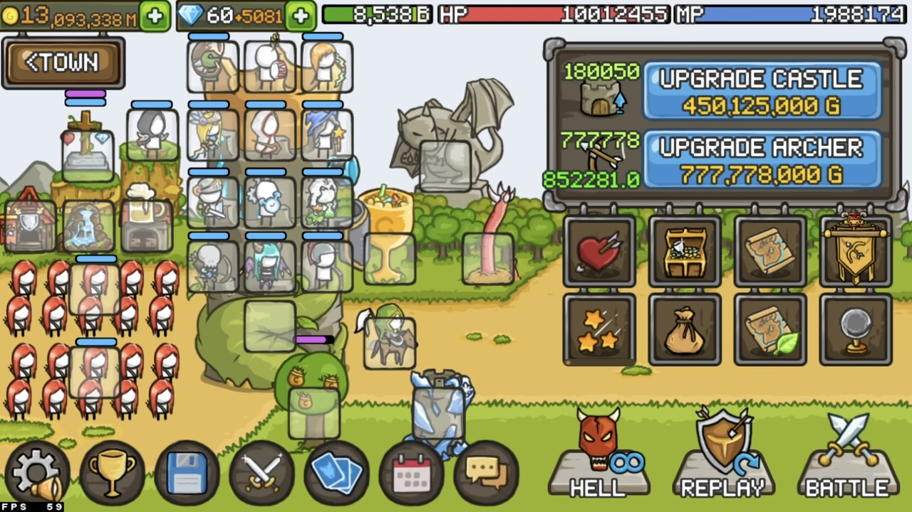
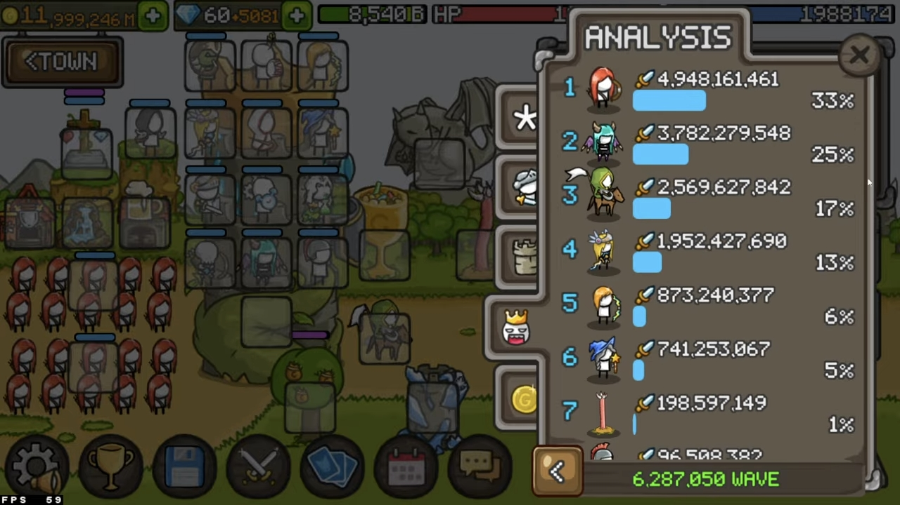
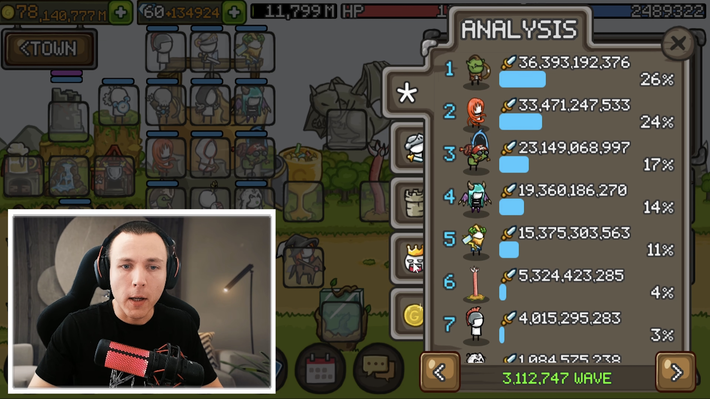
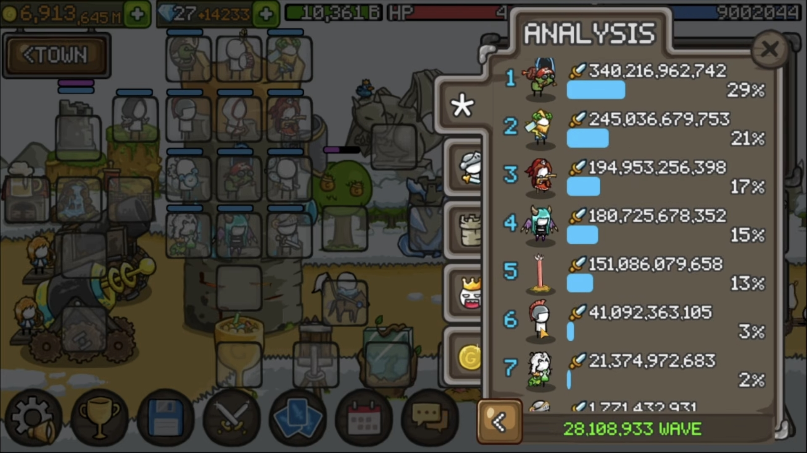

export const ratio = (totalWaves, level) =>
  (totalWaves / level).toFixed(2);

export const castleGold = (level) => 
  level * level * 1250;

export const taGold = (level) =>
  level * level * 500;

export const heroGold = (level) => {
  if (level <= 0) return 0;

  const thresholds = [
    10000, 5000, 200, 180, 160, 140, 120, 100, 80, 60, 40, 20, 1,
  ];
  const baseGold = [
    187458432500, 37468432500, 35632500, 26157500, 18530000, 12530000,
    7997500, 4712500, 2475000, 1085000, 342500, 47500, 0,
  ];
  const baseMultiplier = [
    50000000, 20000000, 600000, 450000, 360000, 280000, 210000, 150000,
    100000, 60000, 30000, 10000, 250,
  ];
  const increment = [
    5000, 4000, 3000, 2500, 2250, 2000, 1750, 1500, 1250, 1000, 750, 500, 250,
  ];

  for (let i = 0; i < thresholds.length; i++) {
    if (level > thresholds[i]) {
      const diff = level - thresholds[i];
      return ((baseMultiplier[i] * 2 + increment[i] * (diff - 1)) / 2 * diff) +
        baseGold[i];
    }
  }

  return 0;
};

export const buildRatio = (totalWaves, totalGold) =>
  (totalGold / (totalWaves ** 2)).toFixed(2);

export const teacher_coke = {
  totalWaves: 9274547,
  castle: 435000,
  ta: 1486000,
  goblin: 470500,
  angel: 100000,
  succubus: 360010,
  slingers: 60000,
  elizabeth: 410000,
}

export const erecnisnI = {
  totalWaves: 6280000,
  castle: 180050,
  ta: 777778,
  archer: 220000,
  angel: 90023,
  iceSorceress: 223000,
  paladins: 90020,
  succubus: 240000,
  slingers: 68010,
  sara: 235020,
  worm: 132233,
}

export const ad_dizzydreamz = {
  totalWaves: 3112567,
  castle: 222225,
  ta: 600000,
  goblin: 135000,
  windy: 150000,
  zeus: 135000,
  succubus: 180000,
  paladins: 44444,
  slingers: 44444,
  worm: 111111,
}

export const rb_mana = {
  totalWaves: 28109000,
  castle: 810000,
  elizabeth: 1200000,
  goblin: 1237000,
  zeus: 1100000,
  succubus: 1100000,
  worm: 1170000,
  paladins: 200000,
  slingers: 100000,
};

# Teacher coke - 白袍的绝对压制

- 发布日期：2026-07-14

- 收录日期：2026-07-14

## 阵容图

## 角色装备与属性

> [!WARNING] 警告
> 该阵容中的金 C 数量为 23 + 1，请知悉。

|单位|面板|武器|饰品|
|:----:|:----:|:----:|:----:|
|白袍|CD: 5.36|COOLDOWN -9.2% -> 11.3% FIRE DAMAGE +24.6% -> 30.1% COOLDOWN -1.9 -> 2.3 SECONDS ITEM QUALITY +22.6%|COOLDOWN -9.7% -> 12.1% LIGHTNING DAMAGE +22.8% -> 28.5% COOLDOWN -2.0 -> 2.5 SECONDS ITEM QUALITY +24.9% COOLDOWN SKILL LV +1 CRITICAL CHANCE SKILL LV +1|
|城弓|CD: 8.81|DAMAGE +19.9% DAMAGE +18.9% OWN BONUS GOLD +3.3% OWN BONUS GOLD +3.2%|CRITICAL DAMAGE +48.4% DAMAGE +18.6% CRITICAL DAMAGE +46.9% DAMAGE SKILL LV +1 CAN BE EQUIPPED TO TOWN ARCHERS ATTACK SPEED +9.8%|
|炸弹人|CD: 10.04|CRITICAL DAMAGE +47.0% CRITICAL CHANCE +9.6% COOLDOWN -1.9 SECONDS COOLDOWN SKILL LV +1 TNT DAMAGE +48% ATTACK SPEED +9.9%|CRITICAL DAMAGE +46.8% CRITICAL CHANCE +9.3% COOLDOWN -9.4% COOLDOWN SKILL LV +1 OWN BONUS GOLD +3.9% OWN BONUS GOLD +4.0%|
|魅魔|CD: 11.01|ATTACK SPEED +18.5% CRITICAL CHANCE +10.0% CRITICAL CHANCE +10.0% ATTACK SPEED +9.6% ATTACK SPEED +9.9%|ATTACK SPEED +18.0% ATTACK SPEED +18.2% CRITICAL CHANCE +9.0% BONUS SKILL LV +1 ATTACK SPEED +9.6% ATTACK SPEED +9.8%|
|伊丽莎白|CD: 5.27 蓝耗: 0|CRITICAL CHANCE +9.8% COOLDOWN -9.7% COOLDOWN -2.0 SECONDS POISON MASTERY SKILL LV +1 KRAKEN +2 9.9% CHANCE TO SUMMON A KRAKEN ON ATTACK.|COOLDOWN -9.3% -> 11.4% DAMAGE +18.2% -> 22.3% COOLDOWN -1.9 -> 2.4 SECONDS ITEM QUALITY +22.5% OWN BONUS GOLD +4.0%|
|天使|CD: 10.74|STUN CHANCE +19.0% COOLDOWN -9.2% DAMAGE REDUCED BY +23% (LEADER, SUMMONER ONLY) COOLDOWN SKILL LV +1 SUMMONED HP +9.8%|FIRE DAMAGE +23.5% COOLDOWN -9.5% DAMAGE REDUCED BY +25% (LEADER, SUMMONER ONLY) COOLDOWN SKILL LV +1 SKILL DURATION +0.14|
|青蛙|CD: 14.91 蓝耗: 4.4%|双白金 C|双白加强|
|黑袍|CD: 8.70|红白金 C|红金 C|
|奇异石|CD: 8.93|金 G|双白金 C|
|投矛|CD: 11.97|击晕、减速、金 C|击晕、减速、白金 C|
|骨弓|CD: 4.59|红白金 C|红白、金 G|

## 结算面板

 

## 指数分析

|总波数|指数|
|:----:|:----:|
|{teacher_coke.totalWaves.toLocaleString()}|{buildRatio(teacher_coke.totalWaves, castleGold(teacher_coke.castle) + taGold(teacher_coke.ta) + heroGold(teacher_coke.goblin) + heroGold(teacher_coke.angel) + heroGold(teacher_coke.succubus) + heroGold(teacher_coke.slingers) + heroGold(teacher_coke.elizabeth))}|

| 单位     | 等级                                 | 比例                                           |
| -------- | ------------------------------------ | ---------------------------------------------- |
|城堡     | {teacher_coke.castle.toLocaleString()}    | {ratio(teacher_coke.totalWaves, teacher_coke.castle)}    |
|城弓     | {teacher_coke.ta.toLocaleString()} | {ratio(teacher_coke.totalWaves, teacher_coke.ta)} |
|炸弹人   | {teacher_coke.goblin.toLocaleString()}    | {ratio(teacher_coke.totalWaves, teacher_coke.goblin)}    |
|天使     | {teacher_coke.angel.toLocaleString()}      | {ratio(teacher_coke.totalWaves, teacher_coke.angel)}      |
|魅魔     | {teacher_coke.succubus.toLocaleString()}  | {ratio(teacher_coke.totalWaves, teacher_coke.succubus)}  |
|投矛     | {teacher_coke.slingers.toLocaleString()}  | {ratio(teacher_coke.totalWaves, teacher_coke.slingers)}  |
|伊丽莎白  | {teacher_coke.elizabeth.toLocaleString()}  | {ratio(teacher_coke.totalWaves, teacher_coke.elizabeth)}  |

# erecnisnI - 城弓、魅魔、冰术士、黄毛、毒领

- 来源：[@erecnisnI](https://www.youtube.com/@erecnisnI)

- 视频链接：[YouTube](https://www.youtube.com/watch?v=OolVm2TtfN0)

- 发布日期：2026-06-22

- 收录日期：2026-07-14

<iframe width="100%" height="468"
  src="https://www.youtube.com/embed/OolVm2TtfN0"
  title="erecnisnI"
  frameborder="0" allowfullscreen>
</iframe>

## 阵容图

## 角色装备与属性

|单位|面板|武器|饰品|
|:----:|:----:|:----:|:----:|
|白袍|CD: 5.88|红白 L|FIRE DAMAGE +22.5% -> 28.0% COOLDOWN -9.4% -> 11.4% COOLDOWN -1.9 -> 2.4 SECONDS ITEM QUALITY +24.4%|
|城弓|CD: 8.62|DAMAGE +18.8% CRITICAL DAMAGE +49.3% DAMAGE +18.8% COOLDOWN SKILL LV +1 CAN BE EQUIPPED TO TOWN ARCHERS ATTACK SPEED +9.9%|CRITICAL DAMAGE +46.7% CRITICAL DAMAGE +44.2% DAMAGE +20.0% ARCHER SPD LV +1 CAN BE EQUIPPED TO TOWN ARCHERS ATTACK SPEED +9.8%|
|黄毛|CD: 10.77|DAMAGE +19.4% CRITICAL DAMAGE +48.9% FLYING DAMAGE +43% COOLDOWN SKILL LV +1 CAN BE EQUIPPED TO TOWN ARCHERS ATTACK SPEED +9.8%|CRITICAL CHANCE +10.0% CRITICAL CHANCE +9.4% +1 ARROW (ARCHER TYPE ONLY) COOLDOWN SKILL LV +1 ATTACK SPEED +9.7% ATTACK SPEED +9.9%|
|冰术士|CD: 2.33 蓝耗: 0|CRITICAL DAMAGE +47.4% -> 58.8% COLD DAMAGE +24.8% -> 30.8% COOLDOWN -1.9 -> 2.3 SECONDS ITEM QUALITY +24.2%|COLD DAMAGE +22.4% -> 26.9% COOLDOWN -9.7% -> 11.7% COOLDOWN -1.7 -> 2.1 SECONDS ITEM QUALITY +20.3% CRITICAL CHANCE SKILL LV +1|
|魅魔|CD: 10.77|CRITICAL DAMAGE +44.3% ATTACK SPEED +18.6% BOSS DAMAGE +48% COOLDOWN SKILL LV +1 ATTACK SPEED +10.0% ATTACK SPEED +10.0%|CRITICAL DAMAGE +48.0% -> 58.7% ATTACK SPEED +19.3% -> 23.6% ATTACK SPEED +19.7% -> 24.1% ITEM QUALITY +22.4% ATTACK SPEED +10.0% ATTACK SPEED +10.0%|
|毒领|CD: 4.31|CRITICAL DAMAGE +49.9% CRITICAL DAMAGE +48.6% BOSS DAMAGE +49% BONUS GOLD SKILL LV +1 POISONING DAMAGE STACKS +1 POISONING DAMAGE STACKS +1|KNOCKBACK CHANCE +19.3% CRITICAL CHANCE +9.0% CRITICAL DAMAGE +48.0% COOLDOWN SKILL LV +1 POISONING DAMAGE STACKS +1|
|青蛙|CD: 17 蓝耗: 5.8%|红白金 C|双白金 C|
|骨弓|CD: 5.01|红白金 C|红白金 C|
|天使|CD: 5.52|红白加强|红白金 C|

## 结算面板

 

## 指数分析

|总波数|指数|
|:----:|:----:|
|{erecnisnI.totalWaves.toLocaleString()}|{buildRatio(erecnisnI.totalWaves, castleGold(erecnisnI.castle) + taGold(erecnisnI.ta) + heroGold(erecnisnI.archer) + heroGold(erecnisnI.angel) + heroGold(erecnisnI.iceSorceress) + heroGold(erecnisnI.paladins) + heroGold(erecnisnI.succubus) + heroGold(erecnisnI.slingers) + heroGold(erecnisnI.sara) + heroGold(erecnisnI.worm))}|

| 单位     | 等级                                 | 比例                                           |
| -------- | ------------------------------------ | ---------------------------------------------- |
|城堡     | {erecnisnI.castle.toLocaleString()}    | {ratio(erecnisnI.totalWaves, erecnisnI.castle)}    |
|城弓     | {erecnisnI.ta.toLocaleString()} | {ratio(erecnisnI.totalWaves, erecnisnI.ta)} |
|黄毛   | {erecnisnI.archer.toLocaleString()}    | {ratio(erecnisnI.totalWaves, erecnisnI.archer)}    |
|天使   | {erecnisnI.angel.toLocaleString()}      | {ratio(erecnisnI.totalWaves, erecnisnI.angel)}      |
|冰术士     | {erecnisnI.iceSorceress.toLocaleString()}  | {ratio(erecnisnI.totalWaves, erecnisnI.iceSorceress)}      |
|骑士     | {erecnisnI.paladins.toLocaleString()}  | {ratio(erecnisnI.totalWaves, erecnisnI.paladins)}  |
|魅魔     | {erecnisnI.succubus.toLocaleString()}  | {ratio(erecnisnI.totalWaves, erecnisnI.succubus)}  |
|投矛     | {erecnisnI.slingers.toLocaleString()}  | {ratio(erecnisnI.totalWaves, erecnisnI.slingers)}  |
|毒领   | {erecnisnI.sara.toLocaleString()}      | {ratio(erecnisnI.totalWaves, erecnisnI.sara)}      |
|吸蓝虫   | {erecnisnI.worm.toLocaleString()}      | {ratio(erecnisnI.totalWaves, erecnisnI.worm)}      |

# AD_DizzyDreamz - 城弓、火风女、炸弹人、魅魔、宙斯

- 来源：[@LakuJK](https://www.youtube.com/@LakuJK)

- 视频链接：[YouTube](https://www.youtube.com/watch?v=nrkbBOHL7lc)

- 发布日期：2026-04-04

- 收录日期：2026-07-14

<iframe width="100%" height="468"
  src="https://www.youtube.com/embed/nrkbBOHL7lc"
  title="AD_DizzyDreamz"
  frameborder="0" allowfullscreen>
</iframe>

## 阵容图

## 角色装备与属性

|单位|面板|武器|饰品|
|:----:|:----:|:----:|:----:|
|白袍|CD: 6.64|红白 L|双白加强 E、CD 符文|
|城弓|CD: 8.62|CRITICAL DAMAGE +48.2% DAMAGE +19.4% BOSS DAMAGE +49% BONUS EXP SKILL LV +1 CAN BE EQUIPPED TO TOWN ARCHERS BOSS DAMAGE +15%|CRITICAL DAMAGE +44.9% DAMAGE +18.4% CRITICAL DAMAGE +47.3% HERO DAMAGE SKILL LV +1 CAN BE EQUIPPED TO TOWN ARCHERS ATTACK SPEED +9.9%|
|宙斯|CD: 11.19|CRITICAL DAMAGE +45.7% DAMAGE +18.4% COOLDOWN -1.7 SECONDS COOLDOWN SKILL LV +1 THUNDER BOLT +2 LIGHTNING DAMAGE +7.5%|CRITICAL CHANCE +9.3% CRITICAL CHANCE +9.7% +2 CHAIN LIGHTNING (LIGHTNING TYPE ONLY) COOLDOWN SKILL LV +1 LIGHTNING DAMAGE +7.3% LIGHTNING DAMAGE +7.3%|
|魅魔|CD: 10.77|ATTACK SPEED +18.5% CRITICAL CHANCE +9.5% ATTACK SPEED +18.3% ATTACK SPEED +8.0% ATTACK SPEED +9.4%|CRITICAL CHANCE +10.0% CRITICAL DAMAGE +44.2% CRITICAL DAMAGE +48.4% ATTACK SPEED +10.0% ATTACK SPEED +9.8%|
|炸弹人|CD: 11.93|CRITICAL CHANCE +10.0% FIRE DAMAGE +24.6% STUN CHANCE +19.6% COOLDOWN SKILL LV +1 TNT DAMAGE +48% OWN BONUS GOLD +4.0%|FIRE DAMAGE +22.3% CRITICAL CHANCE +9.5% +1 ARROW (ARCHER TYPE ONLY) COOLDOWN SKILL LV +1 OWN BONUS GOLD +4.5% OWN BONUS GOLD +4.2%|
|火风女|CD: 5.71|COOLDOWN -9.5% CRITICAL DAMAGE +48.2% COOLDOWN -2.0 SECONDS PERFECT GOLD SKILL LV +1 TORNADO +1 OWN BONUS GOLD +4.9%|DAMAGE +19.0% COOLDOWN -9.2% COOLDOWN -2.0 SECONDS COOLDOWN SKILL LV +1 OWN BONUS GOLD +5.0% OWN BONUS GOLD +4.8%|
|青蛙|CD: 23.45 蓝耗: 7%|单金 C|白金 C|
|投矛|CD: 12.93|击退、减速、金 C|减速、白金 C|
|骑士|CD: 12.93|击退、召唤时间、金 C|击退、减伤、金 C|

## 结算面板

 

## 指数分析

|总波数|指数|
|:----:|:----:|
|{ad_dizzydreamz.totalWaves.toLocaleString()}|{buildRatio(ad_dizzydreamz.totalWaves, castleGold(ad_dizzydreamz.castle) + taGold(ad_dizzydreamz.ta) + heroGold(ad_dizzydreamz.goblin) + heroGold(ad_dizzydreamz.windy) + heroGold(ad_dizzydreamz.zeus) + heroGold(ad_dizzydreamz.succubus) + heroGold(ad_dizzydreamz.paladins) + heroGold(ad_dizzydreamz.slingers) + heroGold(ad_dizzydreamz.worm))}|

| 单位     | 等级                                 | 比例                                           |
| -------- | ------------------------------------ | ---------------------------------------------- |
|城堡     | {ad_dizzydreamz.castle.toLocaleString()}    | {ratio(ad_dizzydreamz.totalWaves, ad_dizzydreamz.castle)}    |
|城弓     | {ad_dizzydreamz.ta.toLocaleString()} | {ratio(ad_dizzydreamz.totalWaves, ad_dizzydreamz.ta)} |
|炸弹人   | {ad_dizzydreamz.goblin.toLocaleString()}    | {ratio(ad_dizzydreamz.totalWaves, ad_dizzydreamz.goblin)}    |
|火风女   | {ad_dizzydreamz.windy.toLocaleString()}      | {ratio(ad_dizzydreamz.totalWaves, ad_dizzydreamz.windy)}      |
|宙斯     | {ad_dizzydreamz.zeus.toLocaleString()}  | {ratio(ad_dizzydreamz.totalWaves, ad_dizzydreamz.zeus)}      |
|魅魔     | {ad_dizzydreamz.succubus.toLocaleString()}  | {ratio(ad_dizzydreamz.totalWaves, ad_dizzydreamz.succubus)}  |
|骑士     | {ad_dizzydreamz.paladins.toLocaleString()}  | {ratio(ad_dizzydreamz.totalWaves, ad_dizzydreamz.paladins)}  |
|投矛     | {ad_dizzydreamz.slingers.toLocaleString()}  | {ratio(ad_dizzydreamz.totalWaves, ad_dizzydreamz.slingers)}  |
|吸蓝虫   | {ad_dizzydreamz.worm.toLocaleString()}      | {ratio(ad_dizzydreamz.totalWaves, ad_dizzydreamz.worm)}      |

# RB_Mana - 纯英

- 来源：[@RedBridgeXgc](https://www.youtube.com/@RedBridgeXgc)

- 视频链接：[YouTube](https://www.youtube.com/watch?v=NR1syRGBlik)

- 发布日期：2026-06-30

- 收录日期：2026-07-14

<iframe width="100%" height="468"
  src="https://www.youtube.com/embed/NR1syRGBlik"
  title="RB_Mana"
  frameborder="0" allowfullscreen>
</iframe>

## 阵容图

## 角色装备与属性

|单位|面板|武器|饰品|
|:----:|:----:|:----:|:----:|
|白袍|CD: 5.68|L|E|
|骑士|CD: 11.67|COOLDOWN -9.7% CRITICAL DAMAGE +49.8% DAMAGE REDUCED BY +23% (LEADER, SUMMONER ONLY) COOLDOWN SKILL LV +1 ATTACK SPEED +9.0% ATTACK SPEED +8.7%|DAMAGE +395 CRITICAL CHANCE +9.8% DAMAGE REDUCED BY +22% (LEADER, SUMMONER ONLY) DAMAGE SKILL LV +1 ATTACK SPEED +8.4%|
|魅魔|CD: 10.77|CRITICAL CHANCE +9.8% CRITICAL DAMAGE +44.6% CRITICAL DAMAGE +48.6% COOLDOWN SKILL LV +1 ATTACK SPEED +9.5% ATTACK SPEED +8.3%|CRITICAL CHANCE +9.8% DAMAGE +395 CRITICAL CHANCE +9.0% COOLDOWN SKILL LV +1 ATTACK SPEED +9.0% ATTACK SPEED +9.8%|
|炸弹人|CD: 11.02|CRITICAL CHANCE +9.8% CRITICAL DAMAGE +46.4% CRITICAL CHANCE +9.5% CRITICAL DAMAGE SKILL LV +1 TNT DAMAGE +35% ATTACK SPEED +8.8%|CRITICAL DAMAGE +47.7% CRITICAL CHANCE +9.9% COOLDOWN -1.9 SECONDS ATTACK SPEED +8.8% ATTACK SPEED +8.2%|
|伊丽莎白|CD: 5.23 蓝耗: 0|COOLDOWN -9.0% -> 11.2% STUN CHANCE +19.9% -> 24.8% COOLDOWN -1.9 -> 2.3 SECONDS ITEM QUALITY +24.7% 9.9% CHANCE TO SUMMON A KRAKEN ON ATTACK. KRAKEN +2|CRITICAL CHANCE +9.4% COOLDOWN -9.9% COOLDOWN -1.8 SECONDS COOLDOWN SKILL LV +1 ATTACK SPEED +9.8% ATTACK SPEED +9.7%|
|青蛙|CD: 13.72 蓝耗: 4.4%|双白加强|双白加强|
|奇异石|CD: 6.32|红白金|E|

## 结算面板

  

## 指数分析

|总波数|指数|
|:----:|:----:|
|{rb_mana.totalWaves.toLocaleString()}|{buildRatio(rb_mana.totalWaves, castleGold(rb_mana.castle) + heroGold(rb_mana.elizabeth) + heroGold(rb_mana.goblin) + heroGold(rb_mana.zeus) + heroGold(rb_mana.succubus) + heroGold(rb_mana.worm) + heroGold(rb_mana.paladins) + heroGold(rb_mana.slingers))}|

| 单位     | 等级                                 | 比例                                           |
| -------- | ------------------------------------ | ---------------------------------------------- |
| 城堡     | {rb_mana.castle.toLocaleString()}    | {ratio(rb_mana.totalWaves, rb_mana.castle)}    |
| 伊丽莎白 | {rb_mana.elizabeth.toLocaleString()} | {ratio(rb_mana.totalWaves, rb_mana.elizabeth)} |
| 炸弹人   | {rb_mana.goblin.toLocaleString()}    | {ratio(rb_mana.totalWaves, rb_mana.goblin)}    |
| 宙斯     | {rb_mana.zeus.toLocaleString()}      | {ratio(rb_mana.totalWaves, rb_mana.zeus)}      |
| 魅魔     | {rb_mana.succubus.toLocaleString()}  | {ratio(rb_mana.totalWaves, rb_mana.succubus)}  |
| 吸蓝虫   | {rb_mana.worm.toLocaleString()}      | {ratio(rb_mana.totalWaves, rb_mana.worm)}      |
| 骑士     | {rb_mana.paladins.toLocaleString()}  | {ratio(rb_mana.totalWaves, rb_mana.paladins)}  |
| 投矛     | {rb_mana.slingers.toLocaleString()}  | {ratio(rb_mana.totalWaves, rb_mana.slingers)}  |
