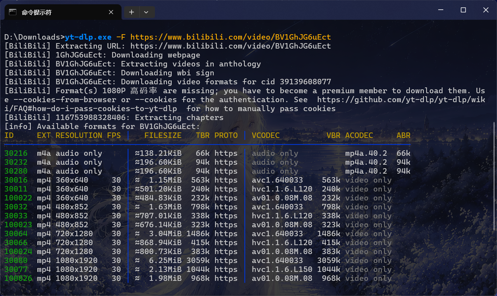

# 简介

一款开源的命令行视频下载工具。

仓库地址：[yt-dlp](https://github.com/yt-dlp/yt-dlp)

---

# 安装与更新

这里只介绍 Windows 中命令行的安装方法。

## 安装

这里用最简单的方式安装 yt-dlp 与 ffmpeg 依赖。

如果没有 ffmpeg，例如在下载 B 站的内容时，视频与音频不会合并。

```bash
pip install yt-dlp              # 从 pip 安装
winget install yt-dlp.FFmpeg    # 从 winget 安装 yt-dlp 官方构建的 ffmpeg，安装好后会自动配置环境变量
```

## 更新

```bash
pip install -U yt-dlp           # 更新 yt-dlp
winget upgrade yt-dlp.FFmpeg    # 更新 ffmpeg
```

---

# 快速上手

1. 默认以最高画质下载

```bash
yt-dlp https://www.bilibili.com/video/{BV号}
```

2. 查看视频所有分辨率、音频信息

```bash
yt-dlp -F https://www.bilibili.com/video/{BV号}
```

会出现类似的以下内容



3. 下载带音频的视频

```bash
yt-dlp -f100026 https://www.bilibili.com/video/{BV号}   # 100026 为视频的 ID
```

4. 只下载音频

```bash
yt-dlp -f30280 https://www.bilibili.com/video/{BV号}    # 30280 为音频的 ID
```

5. 下载音频转为 mp3 格式

```bash
yt-dlp -f30280 -x --audio-form mp3 https://www.bilibili.com/video/{BV号}    # 将音频转为 mp3
```

6. 下载指定视频和音频

```bash
yt-dlp -f100026+30280 https://www.bilibili.com/video/{BV号}
```

7. 通用命令，下载最佳 mp4 视频 + 最佳 m4a 音频，并合并为 mp4 格式

```bash
yt-dlp -f "bestvideo+bestaudio" --merge-output-format mp4 https://www.bilibili.com/video/{BV号}
```

8. 下载更高画质（如 1080p+ ），需要添加参数 `--cookies-from-browser chrome`

> [!WARNING] 警告
> 在 Windows 系统中使用该参数时，需要关闭对应浏览器，否则将无法从浏览器数据库中读取 cookies。详情见[此处](https://github.com/yt-dlp/yt-dlp/issues/7271)。

```bash
# 支持的浏览器：chrome、edge、firefox、safari
yt-dlp --cookies-from-browser chrome https://www.bilibili.com/video/{BV号}
```

9. 如果不想使用浏览器，可以将 cookies 手动导出为 cookies.txt，然后使用以下命令下载

```bash
yt-dlp --cookies cookies.txt https://www.bilibili.com/video/{BV号}
```

10. 给下载的文件自动重命名

占位符：

```
%(title)s：视频标题
%(id)s：视频 ID
%(uploader)s：上传者
%(resolution)s：分辨率
%(ext)s：扩展名
```

以 `上传者 - 视频名称.扩展名` 为例，命令如下：

```bash
yt-dlp -o '%(uploader)s - %(title)s.%(ext)s' https://www.bilibili.com/video/{BV号}
```

11. 如果要预防非法文件名，添加 `--restrict-filenames` 会把空格、特殊字符替换为下划线

```bash
yt-dlp --restrict-filenames -o '%(uploader)s - %(title)s.%(ext)s' https://www.bilibili.com/video/{BV号}
```

12. 添加 `--embed-metadata` 参数写入元信息（标题、简介、艺术家、发行日期等）；添加 `--embed-thumbnail` 参数写入缩略图

13. 添加 `--proxy http://127.0.0.1:7890` 参数可设置下载代理

---

# 默认参数

在 `C:\Users\{用户名}\AppData\Roaming\yt-dlp\config.txt` 中写入参数，可设为默认参数。

```
--embed-metadata
--embed-thumbnail
-o "%USERPROFILE%\Downloads\%(uploader)s - %(title)s.%(ext)s"
--merge-output-format mp4
-f "bestvideo+bestaudio"
```

> [!IMPORTANT] 提示
> 需要根据自身情况修改部分参数！

在命令行中使用时添加 `--ignore-config` 参数，可忽略默认参数。