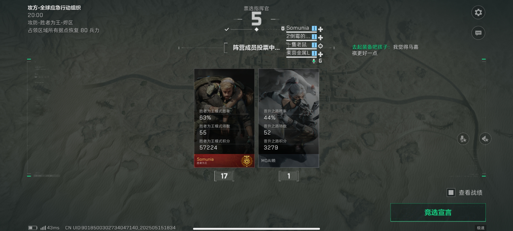
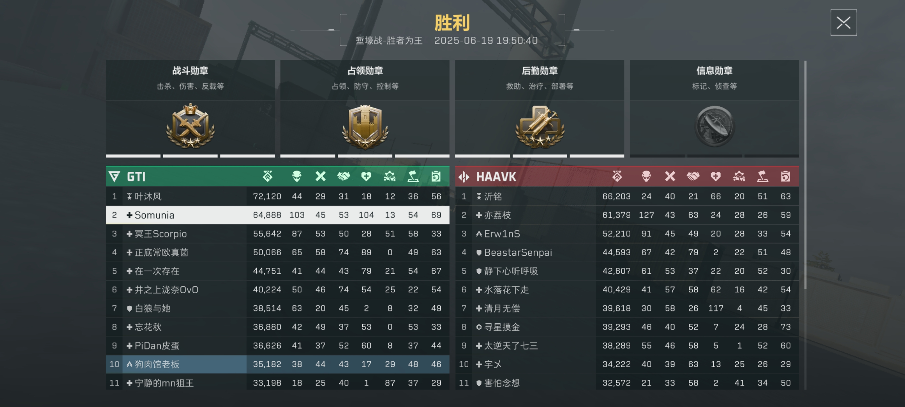
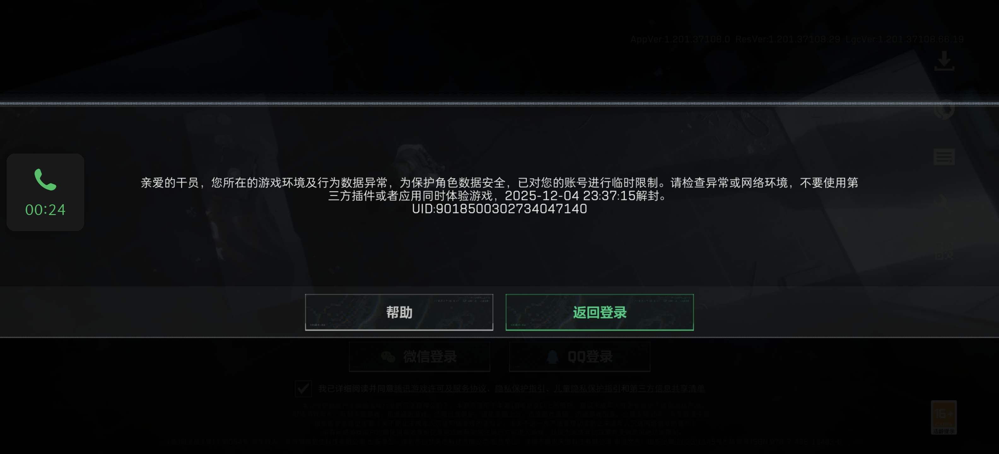
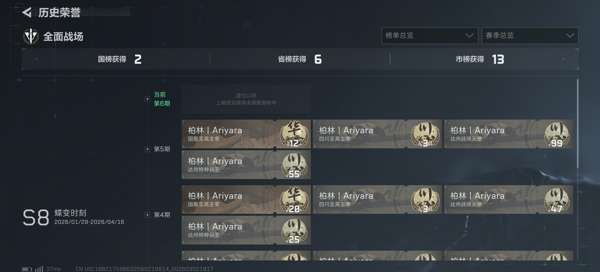
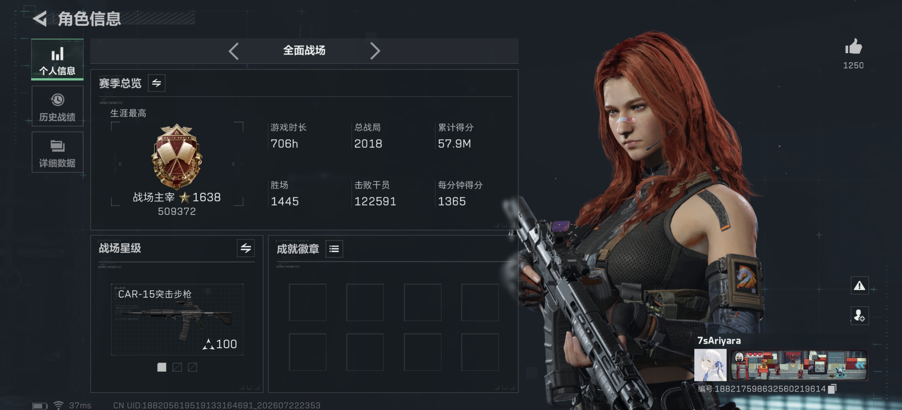

# 初入坑

我从 2024 年 10 月 9 日正式入坑三角洲行动，首次接触的是 PC 端。

在此之前，我从未接触过大战场类型的游戏，而第一次接触全面战场，就深深吸引了我。

在那段时间，我几乎天天有至少 4 个小时泡在全面战场模式里。虽然那个时候的我很菜，分均得分只有六七百分，但依然乐此不疲。

我不会开载具，就喜欢玩医生，当战地多斯积功德。

虽然笔记本的配置很低，但全低画质 + 60 帧依然能流畅运行。

有时候，朋友会拉我去烽火的长弓去跑刀，我也会欣然前往，和朋友们摸金，享受出货的快感。

就这样，它陪伴我度过了 S1 和 S2 赛季。

---

# 转向手游

更新到 S3 赛季后，全低画质 + 60 帧的流畅运行不再，游戏基本玩不下去了，只得转向手游端。

在这段时间，我烽火与战场双修，也是在这段时间，我发现了自己在手游上的表现貌似很不错，对枪之类的经常能占上风。

在烽火，经常与我手游固排一起猛攻机密巴别塔，享受较低成本赚大钱的感觉。在这期间，也创造了近点 Mini-14 一穿三的高光。

当固排不在时，我就单排大战场，继续享受极致对枪。

但到了 S4 赛季，我的固排们上线也不频繁了，渐渐我就淡出了烽火，继续专注于战场。

---

# 胜者为王

S4 赛季最重磅的更新，就是胜者为王模式。

我非常衷心地感谢[林咕咕](https://space.bilibili.com/295099243)，他是我胜者为王模式的引路人和导师，是他带给了我地图理解、战术理解、载具理解、指挥理解和团队配合。

<iframe width="100%" height="468"
  src="//player.bilibili.com/player.html?bvid=BV1VFVQzHE9V&p=1&autoplay=0"
  scrolling="no" border="0" frameborder="no"
  framespacing="0" allowfullscreen="true">
</iframe>

我痴迷于这个热血沸腾的模式，它让我体验到了 20 个人共同配合的默契，以及大家共同向一个目标努力的团队的力量。

那个时候，还没有麦晓雯黑车，没有巡飞齐射，没有空摘载具，没有集体空降，等等。我们凭借最纯粹的步兵与载具的配合，在指挥官的指挥与鼓励下，就为了最终的胜利。

而那个时候，我几乎把把都是指挥官，玩蜂医边救边杀人。

 

在 S4 到 S5 赛季，我认识了很多朋友，经常一起玩胜者为王。

在这期间，我在不断锻炼我的口才与指挥能力，它带给了我一段非常难忘的经历。

而 S6 赛季，胜者为王模式从公测状态转为了正式模式，但我因为个人原因，这个赛季没有怎么玩。

---

# 转变

S7 赛季，我换了一部手机，又可以继续胜者为王了。但是，我遇到了我的第一次封号。

好巧不巧，就在这次封号前的一个星期，我氪了一个麦晓雯的红皮，花了 600 多。

我必须要严正声明，我从来没有使用过任何外挂，没有修改过任何数据，也没有使用过任何第三方软件。

这次封号带给了我极大的愤怒，“琳琅天上是不是在卸磨杀驴？”这就是赤裸裸的背刺。

更恶心的是，在这次解封过后，玩了不到一星期，这个号又被封了，并且封了 30 天。

---

# 偶然

我一气之下打了 12315，但没有任何作用。

于是我开了个小号，与我的固排继续玩胜者为王。虽然以前我经常玩蜂医，但这次既然开了新号，于是我想，不如尝试一下其他位置？

于是，我尝试了疾风。

用一把 CAR-15，把对面打穿了。

我的固排跟我说，他接触到了战队，想加入一个去玩。

我突然想到：战队是否能帮忙向策划反映瞎封号的事情？

我去问了一个战队的队长，他们战队内被封号情况如何，他说特别多。所以，封号问题没办法解决了。但是，我可以通过战队考核，证明我的实力，我没有任何作弊行为，我有实力，我就是被乱封号了。

于是，我与这位固排一起去参加考核，这个战队叫“柏林”。

他考核侦查没有过，但我考核突击过了。

考核通过的那天，是 2025 年 12 月 31 日。

于是，我在柏林战队待了半年。

---

# 偶然之后

<iframe width="100%" height="468"
  src="//player.bilibili.com/player.html?bvid=BV19F6FB9Eoq&p=1&autoplay=0"
  scrolling="no" border="0" frameborder="no"
  framespacing="0" allowfullscreen="true">
</iframe>

这是 S8 赛季第一天的视频。在这个赛季，我也拿到了国标。

我怀念这段日子，我与我最好的固排，[姿](https://v.douyin.com/w9xSlUzJUwI/)，几乎天天一起打，甚至在春节 14 天假期里，我们都天天冲分，胜率达到了恐怖的 75%+。

他步载双修，我则玩纯步兵，也经常给他修车。我在柏林战队里面，也管自己叫“突击位焊武帝”。

“只要把对面的工程都清了，车就安全了。”

但在这期间，我依然偶尔被封号，短则一天，长则一周，非常影响我的心态与游戏体验。

然而封号没完，到了 S9 赛季，封号情况愈演愈烈。

我的手机被标记为高危设备，只要玩个两三把，吃一两个举报，就会被封七天，我还无处申诉。

最终，我还是忍不下去了，在 S10 赛季选择了接近退游的方式。

---

# 尾声

写这篇文章的时间的前一天，我的号又被封了七天，这是我这个号**第十二次**被封禁。而我回来玩，也只是因为姿希望我回来玩，让我试试现在还会不会被封。因为在此之前我已经离开这游戏将近两个月了。然而我依然没能逃过被封的命运。

可能是我的步战实力确实勉强还行，总会被吃举报。而封号机制又不分青红皂白，举报吃多了就封号，同一个设备的账号被封多次就被标记为高危设备。

换设备？现在正是电子设备的超高价格时间，为了这个游戏换设备？可别忘了刚氪完金一个星期不到就被封号的经历啊。

现在胜者为王充斥着大量营养师，而琳琅天上对这种恶臭的游戏环境视而不见，战队、路人、营养师都互相看不顺眼。

我对这个游戏很失望。

我怀念曾经的时光，感谢它曾经带给我的快乐与光辉时刻。

现在也许是时候说再见了。